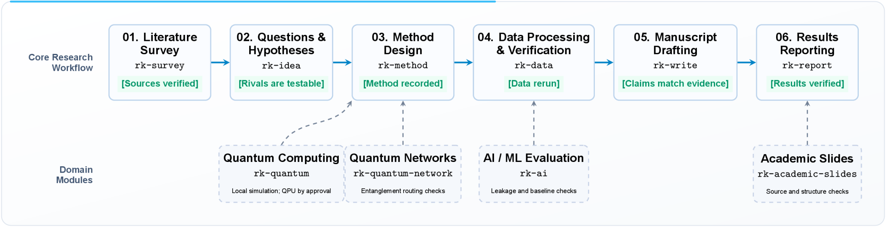
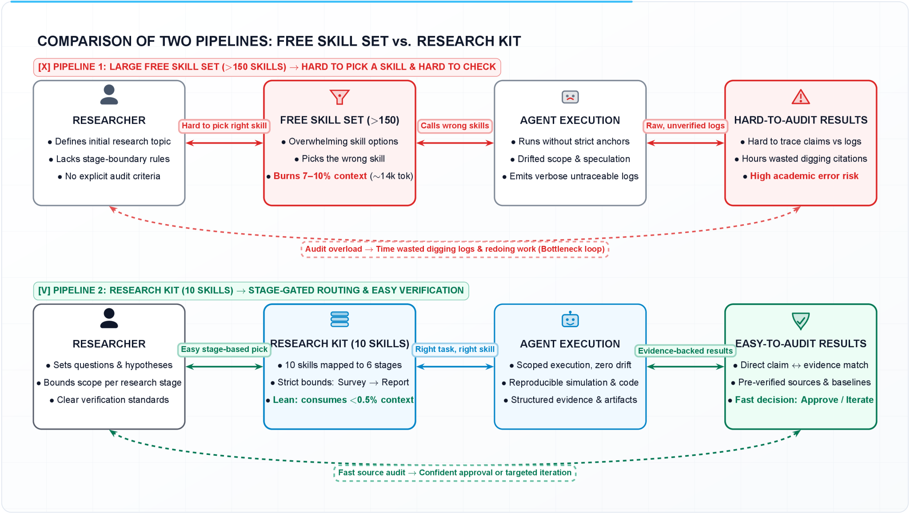
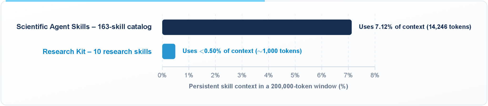
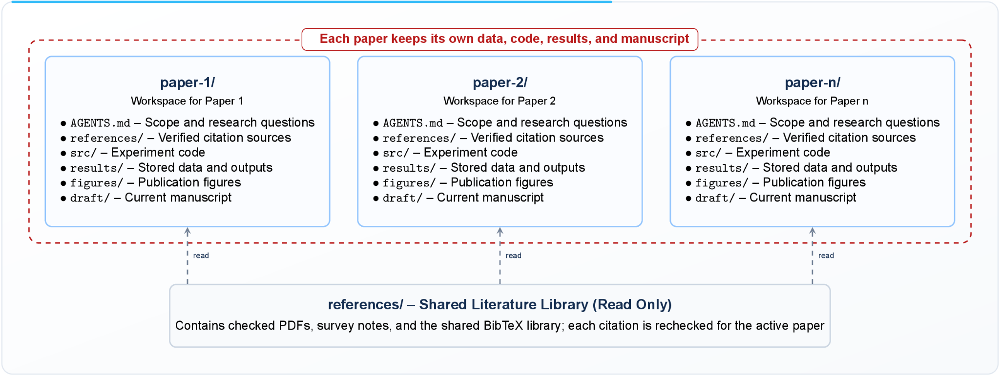

<div align="center">

<p align="center">
  <picture>
    <source media="(prefers-color-scheme: dark)" srcset="figures/logo-dark.svg">
    <source media="(prefers-color-scheme: light)" srcset="figures/logo-light.svg">
    
  </picture>
</p>

# Research Kit: Lean & Reproducible Research Skills for AI Agents

**A lean, reproducible suite of research skills guiding AI agents through the complete scientific paper lifecycle—with empirical rigor, zero bloat, and <0.50% standing context overhead. The kit comprises a 6-skill core pipeline and 4 specialist extensions.**

<p align="center">
  <a href="README.md"></a>
  <a href="README.vi.md"></a>
</p>

<div style="width: 100%; height: 2px; margin: 20px 0; background: linear-gradient(90deg, transparent, #2563eb, transparent);"></div>

</div>

## Contents

- [Overview & High-Level Architecture](#overview--high-level-architecture)
  - [Part 1: Core Pipeline — 6 Skills for the Scientific Paper Lifecycle](#part-1-core-pipeline--6-skills-for-the-scientific-paper-lifecycle)
  - [Part 2: Specialist Extensions — 4 Domain-Specific Skills (Author's Research Focus)](#part-2-specialist-extensions--4-domain-specific-skills-authors-research-focus)
- [Installation & Quick Start](#installation--quick-start)
  - [1. Using the Skills CLI (Recommended)](#1-using-the-skills-cli-recommended)
  - [2. Using GitHub CLI (v2.90.0+)](#2-using-github-cli-v2900)
  - [3. Agent-Assisted Installation (via ZIP)](#3-agent-assisted-installation-via-zip)
  - [4. Manual Installation](#4-manual-installation)
  - [5. Verification & Test Suite](#5-verification--test-suite)
- [Documentation](#documentation)
- [Comparison & Key Advantages](#comparison--key-advantages)
  - [Direct Comparison: Scientific Agent Skills (v2.65.0) & Science Superpowers vs. Research Kit](#direct-comparison-scientific-agent-skills-v2650--science-superpowers-vs-research-kit)
  - [Key Advantages & Architectural Principles](#key-advantages--architectural-principles)
- [Companion References & Field Templates](#companion-references--field-templates)
- [References & Prior Art](#references--prior-art)

## Overview & High-Level Architecture

Research Kit is an open-source suite of procedural research skills designed to guide AI coding and research agents (Cursor, Claude Code, Codex, Antigravity) through end-to-end scientific paper development. From literature discovery and hypothesis formulation to experimental protocol freeze, fresh data rerun verification, and manuscript drafting, Research Kit enforces empirical rigor at every stage.

The kit is organized into **two parts**:
- **Core Pipeline (6 skills)**: Covers the complete scientific paper lifecycle — from literature survey through dissemination — forming a deterministic, stage-by-stage execution pipeline.
- **Specialist Extensions (4 skills)**: Domain-specific modules reflecting the author's research interests (quantum computing, quantum networking, AI/ML, and academic presentations). These are provided as references and can be adapted or replaced to suit your own research domain.

Unlike large catalogs such as **Scientific Agent Skills** (v2.65.0, which packages 163 uncurated skills consuming 14,246 standing tokens before execution begins), Research Kit consumes less than **0.50%** of a standard context window.

<p align="center">
  
</p>

### Part 1: Core Pipeline — 6 Skills for the Scientific Paper Lifecycle

These 6 skills form the backbone of Research Kit, covering every stage from literature survey to dissemination in a deterministic, sequential pipeline:

| Skill | Stage | Primary Responsibility | Mandatory Quality Gate |
| :--- | :--- | :--- | :--- |
| [`rk-survey`](skills/rk-survey/SKILL.md) | **01. Literature Survey** | Systematic search, citation validation, gap analysis | Evidence boundary locked & source provenance check |
| [`rk-idea`](skills/rk-idea/SKILL.md) | **02. Idea & Hypotheses** | Research question framing, rival explanations, falsification criteria | Pursue / Kill decision matrix before coding |
| [`rk-method`](skills/rk-method/SKILL.md) | **03. Method & Protocol** | Experimental design, controls, power analysis, compute budget | Protocol freeze (prevents post-hoc p-hacking) |
| [`rk-data`](skills/rk-data/SKILL.md) | **04. Data & Analysis** | Exploratory inspection, statistical testing, publication figures | Mandatory fresh rerun check before claiming |
| [`rk-write`](skills/rk-write/SKILL.md) | **05. Drafting & Revision** | Structured drafting, 1 idea/paragraph, reviewer rebuttal | 100% claim-to-evidence alignment audit |
| [`rk-report`](skills/rk-report/SKILL.md) | **06. Dissemination** | Progress briefings, executive summaries, defense presentations | Structured reporting gate (grounded claims only) |

### Part 2: Specialist Extensions — 4 Domain-Specific Skills (Author's Research Focus)

These skills are tailored to the author's research domains and serve as practical references. You can adopt, adapt, or replace them to match your own specialization:

| Skill | Domain | Primary Responsibility | Mandatory Quality Gate |
| :--- | :--- | :--- | :--- |
| [`rk-quantum`](skills/rk-quantum/SKILL.md) | Quantum Computing | Local Hamiltonian/circuit simulation & variational algorithms | Local simulation default; QPU spend requires approval |
| [`rk-quantum-network`](skills/rk-quantum-network/SKILL.md) | Quantum Networking | Entanglement distribution, repeater memory, routing & scheduling | Fidelity checks & protocol verification |
| [`rk-ai`](skills/rk-ai/SKILL.md) | AI / Machine Learning | Train/val/test splits, leakage audit, baselines & generative eval | Zero data leakage & reproducible seed verification |
| [`rk-academic-visualize`](skills/rk-academic-visualize/SKILL.md) | Scientific Visualization & Slides | Publication-grade illustrations (LaTeX/TikZ, Mermaid) & source-grounded slide decks | Cognitive load filtering, anti-overlap arrow rules & deck checks |

---

## Installation & Quick Start

### 1. Using the Skills CLI (Recommended)
Install the entire suite directly into your active project or agent environment via the [skills CLI](https://github.com/vercel-labs/skills):
```bash
npx skills add vinhnt21/research-kit
```

### 2. Using GitHub CLI (v2.90.0+)
Target specific AI agent environments with native GitHub CLI commands:
```bash
# Target Cursor
gh skill install vinhnt21/research-kit --agent cursor

# Or target other environments:
# --agent claude-code
# --agent codex
# --agent antigravity
```

#### Updating installed skills

Both installers can refresh already-installed skills after their source changes. Use the same tool you originally used to install them:

```bash
# Skills CLI: check and update installed skills
npx skills update

# GitHub CLI: preview updates, then apply them interactively
gh skill update --dry-run
gh skill update
```

The Skills CLI also accepts `npx skills upgrade` as an alias for `update`; GitHub CLI uses `gh skill update`. For unattended updates, use `npx skills update -y` or `gh skill update --all`. Both CLIs also accept skill names to update only selected skills, for example `npx skills update rk-ai` or `gh skill update rk-ai`. A newly added skill is not an update to an existing installation; rerun the corresponding install command to add it. See the official [Skills CLI update guide](https://github.com/vercel-labs/skills#skills-update) and [`gh skill update` reference](https://cli.github.com/manual/gh_skill_update).

### 3. Agent-Assisted Installation (via ZIP)
1. Download the repository ZIP: [research-kit-main.zip](https://github.com/vinhnt21/research-kit/archive/refs/heads/main.zip).
2. Prompt your AI agent (Cursor, Claude Code, Codex, Antigravity) to install automatically:
   ```text
   Extract the downloaded research-kit-main.zip and copy all folders from skills/rk-* into your skills directory (~/.cursor/skills/, ~/.claude/skills/, ~/.codex/skills/, or ~/.agents/skills/).
   ```

### 4. Manual Installation
Copy the `skills/rk-*` folders directly into your target agent's skill directory:
- **Cursor**: `~/.cursor/skills/`
- **Claude Code**: `~/.claude/skills/`
- **Codex**: `${CODEX_HOME:-$HOME/.codex}/skills/`
- **Antigravity / Universal Agents**: `~/.agents/skills/`

### 5. Verification & Test Suite
Verify skill integrity, frontmatter bounds, and link graphs:
```bash
python3 scripts/check-suite.py
```

Regenerate public documentation figures *(requires XeLaTeX and Ghostscript)*:
```bash
python3 scripts/render-doc-figures.py
```

---

## Documentation

Public guides live in [`documents/`](documents/):

| Guide | Description |
| :--- | :--- |
| [`documents/guide.md`](documents/guide.md) | Full operational handbook (English): install/update/uninstall, managing multiple papers in one repo, per-skill reference, end-to-end playbook, decision matrix, and anti-patterns |
| [`documents/guide.vi.md`](documents/guide.vi.md) | Same handbook in Vietnamese |

Browse the interactive version on the site: [Docs](https://research-kit.vinhnguyenthanh.com/docs).

---

## Comparison & Key Advantages

Scientific inquiry using AI agents currently suffers from severe standing context bloat, routing hallucinations, and brittle framework dependencies. Research Kit was engineered specifically to solve the architectural bottlenecks found in earlier libraries like **Scientific Agent Skills** (Kassis et al., 2026) and **Science Superpowers** (K-Dense-AI).

<p align="center">
  
</p>

<p align="center">
  
</p>

### Direct Comparison: Scientific Agent Skills (v2.65.0) & Science Superpowers vs. Research Kit

| Dimension | Scientific Agent Skills (v2.65.0, 163 Skills) & Prior Art | Research Kit (10 Streamlined Skills) | Practical Research Advantage |
| :--- | :--- | :--- | :--- |
| **Catalog Architecture** | **Scientific Agent Skills**: 163 fragmented, overlapping mini-skills across 16 domains | **10 end-to-end lifecycle skills** | **Streamlined & convenient**; eliminates tool choice overload |
| **Research Focus** | **Scientific Agent Skills**: Agent gets lost in tool search & install loops across 163 candidates | **Deterministic stage-by-stage routing** | **100% focused on core scientific discovery** |
| **Standing Token Overhead** | **Scientific Agent Skills**: 14,246 tokens (7.12% of context window) before reading files | **~1,000 tokens (<0.50% of context window)** | **Frees >99.5% of context** for raw data, papers, and deep reasoning |
| **Operational Reliability** | **Scientific Agent Skills & Superpowers**: 105 external scripts & brittle session-start hooks | **0 external scripts (pure procedural specs)** | **Zero runtime drift**, transparent, and portable across all agents |
| **Framework & Multi-Paper Repo** | **Science Superpowers**: Forces `docs/science-superpowers/` and git freeze; lacks multi-paper-in-one-repo support | **Active Paper Declaration, strict evidence boundaries, and flexible layouts** | **Guaranteed data integrity** across manuscripts in the same repo with zero forced lock-in |

### Key Advantages & Architectural Principles

#### 1. Standing Context Window Economy (<0.50% Footprint)
Under the [Agent Skills specification](https://agentskills.io/specification), an agent platform preloads each skill's `name` and `description` into the persistent system prompt at session initialization.
- **Scientific Agent Skills (v2.65.0) Overhead**: 163 resident descriptions consume **14,246 tokens**—over **7.12%** of a standard 200,000-token window before the agent reads a single word of your paper or data (Kassis et al., 2026).
- **Research Kit Economy**: Research Kit provides exactly 10 neighbor-aware skills. The combined descriptions total 2,335 characters and 327 words, consuming **<0.50%** (<1,000 tokens).
- **Practical Benefit**: Research Kit conserves over **13,000 tokens** on every prompt turn, preserving critical reasoning capacity for raw experimental data, extensive literature synthesis, and complex paper drafting.

#### 2. Deterministic Stage-by-Stage Routing (Neighbor-Aware)
Each skill owns exactly one well-defined research stage and explicitly references its neighboring steps. An agent working on literature remains within `rk-survey`. A locked methodology belongs to `rk-method`. A claim lacking a fresh execution checkpoint stays in `rk-data`. Routing happens naturally and conveniently without hallucinated tool searches across 160+ options.

#### 3. Multiple Papers in One Repo & Evidence Boundaries
In empirical research, a single repository frequently hosts multiple related ideas, hypotheses, or manuscripts concurrently. Without rigorous boundaries, AI agents easily trigger cross-contamination: reusing uncommitted exploratory numbers as baselines, or importing unverified claims across sister drafts.

<p align="center">
  
</p>

```text
my-research-project/           # Overall research topic (1 Repository / Root Workspace)
├── AGENTS.md                  # Global context, conventions, and lab guidelines
├── literature/                # Shared reference library (Read-Only)
│   ├── references.bib         # Global BibTeX citation repository
│   └── pdfs/                  # Reference papers, PDFs, and preprints
│
├── papers/                    # Partitioned workspaces for individual ideas/papers
│   ├── 2026-quantum-routing/  # [Idea A / Paper 1] - Separate workspace in same repo
│   │   ├── AGENTS.md          # Active Paper declaration: scope, questions, hypotheses
│   │   ├── src/               # Dedicated experimental code for Paper 1
│   │   ├── data/              # Dedicated data & independent rerun verification logs
│   │   ├── figures/           # Rendered publication figures for Paper 1
│   │   └── manuscript/        # Manuscript source files (LaTeX / Markdown)
│   │
│   └── 2026-repeater-sched/   # [Idea B / Paper 2] - Separate workspace in same repo
│       ├── AGENTS.md          # Active Paper declaration: scope, questions, hypotheses
│       ├── src/               # Dedicated experimental code for Paper 2
│       ├── data/              # Dedicated data & rerun logs for Paper 2
│       ├── figures/           # Rendered publication figures for Paper 2
│       └── manuscript/        # Manuscript source files for Paper 2
│
└── shared/                    # (Optional) Shared utility scripts or verified libraries
```

- **Target Paper Declaration (Active Paper Resolution)**: The agent must identify and declare the active paper from the prompt, `cwd`, or local `AGENTS.md` before reading files or running experiments. If ambiguous, the agent must ask for clarification.
- **Strict Evidence Boundary**: A sibling draft, sister experiment folder, uncommitted script, or unpublished result from another paper is **never valid evidence, baseline data, or citation material** for the active paper.
- **Audited Read-Only Literature Shelf**: Centralized literature (`literature/`) is shared for universal reference, but every cited reference must be independently audited against the active paper's specific claims.
- **Zero Dogmatic Lock-In**: Labs may name directories `papers/`, `studies/`, `ideas/`, or `manuscripts/`. Research Kit requires only the core operational invariant: each paper is a separate workspace in the same repo with an unambiguous Active Paper declaration.

#### 4. Pure Procedural Rigor (Zero Framework Lock-In)
- **No Forced Directory Trees**: Unlike **Science Superpowers** which mandates `docs/science-superpowers/`, session-start git hooks, and disruptive git freeze commits, Research Kit leaves directory structure and git control 100% to the project.
- **Pre-Registration as a Tool, Not a Dogma**: Pre-registration is supported for prospective confirmatory trials where appropriate, without blocking mathematical derivations or exploratory prototyping.
- **Zero Proprietary Harness Dependencies**: Operates independently of any single agent UI, runtime harness, or proprietary subagent protocol.

#### 5. Live Documentation over Static Copies
Scientific libraries (such as Qiskit, QuTiP, PennyLane, PyTorch, and scikit-learn) evolve rapidly. Rather than distributing static, outdated copies of library manuals, skills instruct agents to query the official, live documentation of the packages actively installed in the environment.

---

## Companion References & Field Templates

Each skill ships with localized procedural guidelines (`references/`) and production field templates (`assets/`). Through progressive disclosure, agents only load these operational scaffolds when a specific skill is actively triggered:

| Skill | Companion Reference Documents (`references/`) & Field Templates (`assets/`) |
| :--- | :--- |
| `rk-survey` | `references/search-boundary.md`, `references/citation-check.md`, `references/evidence-map.md`<br>`assets/search-record.md`, `assets/citation-checklist.md` |
| `rk-idea` | `references/framing.md`, `references/hypothesis-quality.md`, `references/rivals-and-falsification.md`, `references/biases-and-fallacies.md`<br>`assets/hypothesis-record.md`, `assets/rival-matrix.md` |
| `rk-method` | `references/design-choice.md`, `references/power-and-precision.md`, `references/feasibility-and-freeze.md`<br>`assets/method-plan.md` |
| `rk-data` | `references/inspect.md`, `references/test-choice.md`, `references/figures.md`, `references/anomalies-and-rerun.md`<br>`assets/analysis-record.md` |
| `rk-write` | `references/claim-evidence.md`, `references/section-roles.md`, `references/paragraph-flow.md`, `references/review-and-response.md`<br>`assets/claim-evidence.md` |
| `rk-report` | `references/report-gate.md`<br>`assets/report-record.md` |
| `rk-quantum` | `references/model-checks.md`, `references/execution-boundary.md`<br>`assets/quantum-run-record.md` |
| `rk-ai` | `references/leakage-and-splits.md`, `references/evaluation.md`<br>`assets/ml-eval-record.md` |

*(Note: `rk-quantum-network` operates as a self-contained skill specification. `skills/rk-academic-visualize` packages scientific visualization guidelines with the author's verified presentation templates and deck verification test suite).*

---

## References & Prior Art

Research Kit synthesizes proven scientific methodologies while eliminating framework bloat. All rewritten skills contain fresh procedural text licensed under [Apache-2.0](LICENSE). Upstream licenses remain with their original authors.

| Prior Art / Source | Citation / Version | Bottleneck in Prior Work | Principle Retained in Research Kit | How Research Kit Resolves It |
| :--- | :--- | :--- | :--- | :--- |
| **[Scientific Agent Skills](https://github.com/K-Dense-AI/scientific-agent-skills)** | `v2.65.0`<br>[arXiv:2609.00065](https://arxiv.org/abs/2609.00065) | 163 fragmented skills consuming 14,246 standing tokens (7.12% of context); 105 external scripts; 29 credentialed env vars; context overflow in 29/46 workflows. | Clear functional decomposition across research concerns: literature, methodology, empirical data, writing, quantum, and ML eval. | Condensed into **10 neighbor-aware skills** (<1,000 tokens, <0.50% footprint); 0 external scripts; 0 credentialed APIs; 100% focused on research workflows. |
| **[Science Superpowers](https://github.com/K-Dense-AI/science-superpowers)** | Commit [`0374bdf`](https://github.com/K-Dense-AI/science-superpowers/commit/0374bdf) | Dogmatic "Iron Law" of mandatory pre-registration for everything; automated git freeze scripts; harness-specific startup hooks; forced `docs/science-superpowers/` directory layout. | Rigorous sequential quality gates: question framing, search boundary, protocol design, anomaly investigation, and rerun check before claiming. | Preserves all empirical quality gates without dogma: pre-registration is a method choice for confirmatory trials; 0 forced hooks/commits; project-owned directory layouts. |
| **[Research Paper Writing Skills](https://github.com/Master-cai/Research-Paper-Writing-Skills)** | Commit [`77e7c2c`](https://github.com/Master-cai/Research-Paper-Writing-Skills/commit/77e7c2c) | Single skill tightly coupled to a rigid ML/CV/NLP manuscript outline; lacks domain-specific experimental checks. | Structural writing discipline: single core idea per paragraph, strict 100% claim-to-evidence alignment, and structured rebuttal workflows. | Decoupled into `rk-write` for universal scientific manuscript drafting; domain-specific checks are delegated to modular extensions (`rk-quantum`, `rk-ai`, etc.). |
| **[NVIDIA Skills](https://github.com/NVIDIA/skills)** | Commit [`d8519c5`](https://github.com/NVIDIA/skills/commit/d8519c5) | Large, vendor-specific product catalog with static CLI instructions and risk of accidental spend on cloud QPU backends. | Strict execution boundary discipline: local simulation is default; physical hardware/QPU execution requires explicit authorization. | Integrated safe local simulation defaults into `rk-quantum` with live documentation queries; physical QPU spend strictly requires explicit user approval. |
| **[Agent Skills Specification](https://agentskills.io/specification)** | Spec (1 Oct 2026) | Uncurated skill catalogs easily overwhelm the client's standing context window during session initialization. | Standardized directory structure: single `SKILL.md` per skill, lightweight `name` and `description` for preloading, dynamic on-demand asset loading. | Strict 10-skill ceiling with lightweight metadata (~100 tokens per skill), achieving full spec compliance under <0.50% standing context. |
