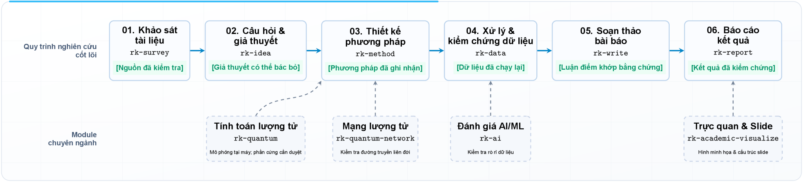
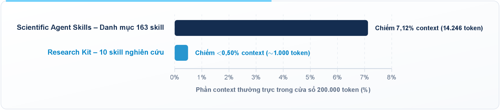
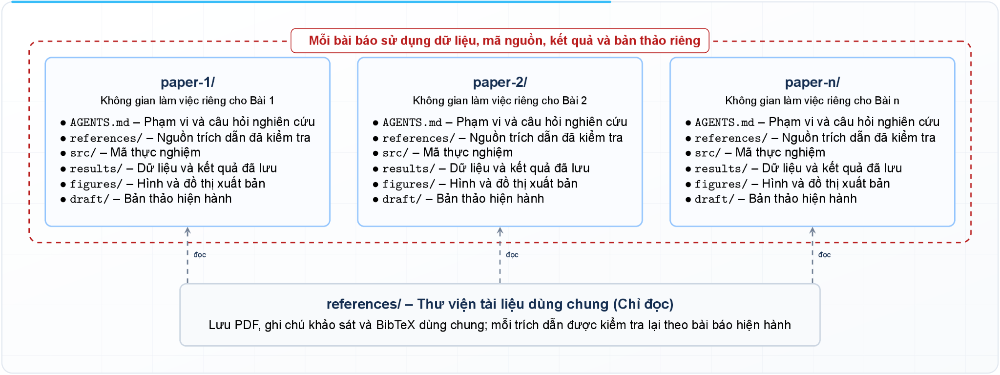

<div align="center">

# 🔬 Research Kit: Bộ Skill Nghiên Cứu Khoa Học Tinh Gọn Cho AI Agent

**Bộ skill nghiên cứu khoa học tinh gọn, chuẩn mực và có thể tái lập dành cho AI Agent — đảm bảo tính nghiêm ngặt thực nghiệm, không phình tải, và chiếm chưa đầy <0,50% context thường trực. Bộ kit gồm 6 skill quy trình cốt lõi và 4 skill chuyên ngành mở rộng.**

<p align="center">
  <a href="README.md"></a>
  <a href="README.vi.md"></a>
</p>

<div style="width: 100%; height: 2px; margin: 20px 0; background: linear-gradient(90deg, transparent, #2563eb, transparent);"></div>

</div>

## Tổng quan & Kiến trúc Hệ thống

Research Kit là bộ công cụ mã nguồn mở gồm các **skill nghiên cứu theo quy trình**, được thiết kế để dẫn dắt các AI coding và research agent (Cursor, Claude Code, Codex, Antigravity) thực thi trọn vẹn vòng đời phát triển một bài báo khoa học. Từ khảo sát tài liệu, hình thành giả thuyết, đến đóng băng giao thức thực nghiệm, chạy lại kiểm chứng dữ liệu thô, và soạn thảo bản thảo — Research Kit đảm bảo tính nghiêm ngặt khoa học ở từng giai đoạn.

Bộ kit được tổ chức thành **hai phần chính**:
- **Phần 1 — Quy trình Cốt lõi (6 skill)**: Bao quát toàn bộ vòng đời bài báo khoa học — từ khảo sát tài liệu đến phổ biến kết quả — tạo thành một pipeline thực thi tuần tự, rành mạch từng giai đoạn.
- **Phần 2 — Mở rộng Chuyên ngành (4 skill)**: Các module chuyên sâu phản ánh hướng nghiên cứu của tác giả (tính toán lượng tử, mạng lượng tử, AI/ML, và trình bày học thuật). Đây là các skill tham khảo — bạn có thể sử dụng, điều chỉnh hoặc thay thế cho phù hợp với lĩnh vực nghiên cứu của mình.

So với các thư viện quy mô lớn như **Scientific Agent Skills** (bản v2.65.0, chứa 163 skill chưa qua sàng lọc, chiếm tới 14.246 token thường trực ngay khi mở phiên), Research Kit chỉ chiếm chưa đầy **<0,50%** cửa sổ context tiêu chuẩn.

<p align="center">
  
</p>

### Phần 1: Quy trình Cốt lõi — 6 Skill cho Vòng đời Bài báo Khoa học

6 skill này tạo thành xương sống của Research Kit, bao quát mọi giai đoạn từ khảo sát tài liệu đến phổ biến kết quả theo một pipeline tuần tự rành mạch:

| Skill | Giai đoạn | Trách nhiệm chính | Cổng kiểm định bắt buộc |
| :--- | :--- | :--- | :--- |
| [`rk-survey`](skills/rk-survey/SKILL.md) | **01. Khảo sát tài liệu** | Tìm kiếm có hệ thống, kiểm tra trích dẫn, phân tích khoảng trống | Khóa biên bằng chứng & thẩm định nguồn gốc |
| [`rk-idea`](skills/rk-idea/SKILL.md) | **02. Ý tưởng & Giả thuyết** | Đặt câu hỏi nghiên cứu, giả thuyết đối lập, tiêu chí bác bỏ | Ma trận Quyết định Làm / Dừng trước khi viết mã |
| [`rk-method`](skills/rk-method/SKILL.md) | **03. Phương pháp & Giao thức** | Thiết kế thí nghiệm, đối chứng, phân tích công suất, ngân sách | Đóng băng giao thức (chống chỉnh sửa p-hacking sau thí nghiệm) |
| [`rk-data`](skills/rk-data/SKILL.md) | **04. Dữ liệu & Phân tích** | Kiểm tra dữ liệu thô, phân tích thống kê, tạo đồ thị công bố | Bắt buộc chạy lại kiểm chứng trước khi đưa ra kết luận |
| [`rk-write`](skills/rk-write/SKILL.md) | **05. Soạn thảo & Chỉnh sửa** | Viết bài có cấu trúc, mỗi đoạn một ý, phản hồi phản biện | Khớp 100% giữa kết luận và bằng chứng thực nghiệm |
| [`rk-report`](skills/rk-report/SKILL.md) | **06. Phổ biến & Báo cáo** | Tóm tắt tiến độ, báo cáo tổng hợp, bài trình bày bảo vệ | Cổng báo cáo chuẩn mực (chỉ chứa kết luận đã kiểm chứng) |

### Phần 2: Mở rộng Chuyên ngành — 4 Skill theo Hướng nghiên cứu của Tác giả

Đây là các skill chuyên sâu phản ánh lĩnh vực nghiên cứu của tác giả. Bạn có thể tham khảo, điều chỉnh hoặc thay thế bằng các skill phù hợp với chuyên ngành của mình:

| Skill | Lĩnh vực | Trách nhiệm chính | Cổng kiểm định bắt buộc |
| :--- | :--- | :--- | :--- |
| [`rk-quantum`](skills/rk-quantum/SKILL.md) | Tính toán lượng tử | Mô phỏng mạch & Hamiltonian cục bộ, thuật toán biến phân | Mặc định mô phỏng cục bộ; chạy QPU phải duyệt ngân sách |
| [`rk-quantum-network`](skills/rk-quantum-network/SKILL.md) | Mạng lượng tử | Phân phối liên đới lượng tử, bộ nhớ trạm lặp, định tuyến & lập lịch | Kiểm tra độ trung thực & thẩm định giao thức |
| [`rk-ai`](skills/rk-ai/SKILL.md) | AI / Học máy | Chia tập train/val/test, kiểm tra rò rỉ dữ liệu, baseline & đánh giá | Chặn rò rỉ dữ liệu & kiểm tra tái lập seed |
| [`rk-academic-slides`](skills/rk-academic-slides/SKILL.md) | Trình bày học thuật | Tạo slide bám nguồn tài liệu & kiểm định bố cục | Kiểm tra tự động cấu trúc slide & chuẩn phong cách |

---

## Hướng dẫn Cài đặt & Bắt đầu Nhanh

### 1. Dùng Skills CLI (Khuyến nghị)
Cài đặt trực tiếp toàn bộ bộ kit vào dự án hoặc môi trường agent qua [skills CLI](https://github.com/vercel-labs/skills):
```bash
npx skills add vinhnt21/research-kit
```

### 2. Dùng GitHub CLI (từ bản v2.90.0)
Cài đặt trực tiếp cho từng môi trường agent cụ thể:
```bash
# Cài đặt cho Cursor
gh skill install vinhnt21/research-kit --agent cursor

# Hoặc chỉ định agent đích khác:
# --agent claude-code
# --agent codex
# --agent antigravity
```

### 3. Tải file ZIP và nhờ Agent tự cài đặt (Agent-Assisted)
1. Tải file ZIP mã nguồn: [research-kit-main.zip](https://github.com/vinhnt21/research-kit/archive/refs/heads/main.zip).
2. Đưa câu lệnh/prompt cho AI Agent (Cursor, Claude Code, Codex, Antigravity) để giải nén và tự động cài đặt:
   ```text
   Hãy giải nén file research-kit-main.zip vừa tải về và sao chép toàn bộ các thư mục bên trong skills/rk-* vào thư mục skills của bạn (~/.cursor/skills/, ~/.claude/skills/, ~/.codex/skills/, hoặc ~/.agents/skills/).
   ```

### 4. Cài đặt thủ công
Sao chép thư mục `skills/rk-*` trực tiếp vào thư mục kỹ năng của agent bạn đang sử dụng:
- **Cursor**: `~/.cursor/skills/`
- **Claude Code**: `~/.claude/skills/`
- **Codex**: `${CODEX_HOME:-$HOME/.codex}/skills/`
- **Antigravity / Agent thông dụng**: `~/.agents/skills/`

### 5. Kiểm định & Bộ Test Suite
Kiểm tra tính toàn vẹn của skill, metadata và liên kết nội bộ:
```bash
python3 scripts/check-suite.py
```

Kết xuất lại toàn bộ biểu đồ tài liệu kỹ thuật *(yêu cầu XeLaTeX và Ghostscript)*:
```bash
python3 scripts/render-doc-figures.py
```

---

## So sánh & Các Ưu điểm Cốt lõi

Nghiên cứu khoa học với AI agent hiện nay gặp phải nhiều vấn đề: context bị lãng phí nghiêm trọng, agent "ảo giác" khi tìm kiếm công cụ, và phụ thuộc vào các framework cứng nhắc. Research Kit được thiết kế để giải quyết trực tiếp các điểm nghẽn kiến trúc tồn tại ở các thư viện trước đó như **Scientific Agent Skills** (Kassis và cộng sự, 2026) và **Science Superpowers** (K-Dense-AI).

<p align="center">
  
</p>

### Bảng So sánh Trực diện: Scientific Agent Skills (v2.65.0) & Science Superpowers vs. Research Kit

| Tiêu chí so sánh | Scientific Agent Skills (v2.65.0, 163 Skill) & Công trình trước | Research Kit (10 Skill Tinh gọn) | Giá trị thực tiễn mang lại |
| :--- | :--- | :--- | :--- |
| **Cấu trúc danh mục** | **Scientific Agent Skills**: 163 skill vụn vặt, chồng chéo chức năng trên 16 lĩnh vực | **10 skill bao hàm trọn vòng đời nghiên cứu** | **Tinh gọn & thuận tiện**, loại bỏ hoàn toàn ma trận lựa chọn công cụ |
| **Độ tập trung nghiên cứu** | **Scientific Agent Skills**: Agent dễ lạc vào ma trận tìm kiếm và cài đặt giữa 163 ứng viên | **Điều hướng 1:1 theo từng giai đoạn chuẩn** | **Tập trung tối đa vào nghiên cứu & bài báo cốt lõi** |
| **Context thường trực** | **Scientific Agent Skills**: Chiếm 14.246 token (7,12% cửa sổ context) ngay từ đầu | **Chỉ tốn ~1.000 token (<0,50% cửa sổ context)** | **Dành trọn >99,5% context** cho dữ liệu thực nghiệm & lập luận |
| **Rủi ro vận hành** | **Scientific Agent Skills & Superpowers**: Phụ thuộc 105 script bên ngoài & hook mở phiên | **0 script phụ (100% tài liệu quy trình chuẩn)** | **Không lỗi runtime**, độc lập với mọi môi trường agent |
| **Ràng buộc framework & Cô lập** | **Science Superpowers**: Ép buộc `docs/science-superpowers/` và git freeze; thiếu cô lập bài báo | **Khai báo Active Paper, ranh giới bằng chứng rành mạch, layout linh hoạt** | **Bảo đảm tuyệt đối tính liêm chính** giữa các bài báo đồng thời mà không bị trói buộc |

### Các Ưu điểm & Luận chứng Kiến trúc

#### 1. Tiết kiệm tối đa Context thường trực (<0,50% Footprint)
Theo [Đặc tả chuẩn Agent Skills](https://agentskills.io/specification), nền tảng agent nạp sẵn `name` và `description` của toàn bộ skill vào system prompt khi khởi động phiên.
- **Mức chiếm dụng của Scientific Agent Skills (v2.65.0)**: 163 phần mô tả chiếm tới **14.246 token**—tương đương **7,12%** cửa sổ context 200.000 token trước khi agent đọc bất kỳ dòng dữ liệu nào (Kassis và cộng sự, 2026).
- **Mức tiêu thụ tối ưu của Research Kit**: Đúng 10 skill tinh gọn với 2.335 ký tự và 327 từ, chiếm chưa đầy **<0,50%** (<1.000 token).
- **Lợi ích thực tiễn**: Tiết kiệm hơn **13.000 token** trên mỗi lượt prompt, dành trọn không gian cho dữ liệu thực nghiệm, tài liệu học thuật và lý giải chuyên sâu.

#### 2. Định tuyến thông minh theo giai đoạn kế cận (Neighbor-Aware Routing)
Mỗi skill phụ trách đúng một giai đoạn nghiên cứu và chỉ dẫn rõ ràng đến các bước kế tiếp. Tài liệu thuộc về `rk-survey`, phương pháp thuộc về `rk-method`, kiểm chứng số liệu thuộc về `rk-data`. Agent tự động định tuyến theo tỷ lệ 1:1 mà không rơi vào vòng lặp tìm kiếm hay chọn nhầm công cụ giữa hơn 160 lựa chọn.

#### 3. Kiến trúc không gian làm việc đa bài báo & Quy tắc cô lập
Trong nghiên cứu thực tế, một repository thường chứa nhiều bài báo hoặc hướng nghiên cứu song song. Nếu thiếu cơ chế phân vùng, AI agent rất dễ gây ô nhiễm chéo: lấy số liệu thử nghiệm của ý tưởng này làm baseline cho ý tưởng khác.

<p align="center">
  
</p>

```text
my-research-project/           # Đề tài nghiên cứu tổng thể (1 Repository / Thư mục đề tài)
├── AGENTS.md                  # Hướng dẫn tổng quan & quy ước chung cho toàn bộ đề tài
├── literature/                # Kệ tài liệu nghiên cứu dùng chung (Chỉ đọc - Read-Only)
│   ├── references.bib         # Danh mục trích dẫn toàn cục của đề tài
│   └── pdfs/                  # Các bài báo, tiền ấn phẩm tải về để tra cứu
│
├── papers/                    # Không gian phân vùng các ý tưởng / bài báo độc lập
│   ├── 2026-quantum-routing/  # [Ý tưởng A / Bài báo 1] - Không gian độc lập
│   │   ├── AGENTS.md          # Khai báo Active Paper: câu hỏi, giả thuyết của Bài 1
│   │   ├── src/               # Mã nguồn thực nghiệm riêng của Bài 1
│   │   ├── data/              # Dữ liệu & log rerun kiểm chứng độc lập của Bài 1
│   │   ├── figures/           # Đồ thị xuất bản riêng của Bài 1
│   │   └── manuscript/        # Bản thảo bài báo (LaTeX / Markdown)
│   │
│   └── 2026-repeater-sched/   # [Ý tưởng B / Bài báo 2] - Không gian độc lập
│       ├── AGENTS.md          # Khai báo Active Paper: câu hỏi, giả thuyết của Bài 2
│       ├── src/               # Mã nguồn thực nghiệm riêng của Bài 2
│       ├── data/              # Dữ liệu & log rerun kiểm chứng độc lập của Bài 2
│       ├── figures/           # Đồ thị xuất bản riêng của Bài 2
│       └── manuscript/        # Bản thảo bài báo của Bài 2
│
└── shared/                    # (Tùy chọn) Tiện ích hoặc mã nguồn thư viện dùng chung
```

- **Xác định bài báo đang làm (Active Paper Resolution)**: Agent bắt buộc phải xác định rõ bài báo mục tiêu từ prompt, thư mục hiện hành (`cwd`) hoặc file `AGENTS.md` cạnh bài báo trước khi thao tác file hay chạy code. Nếu mơ hồ, agent phải hỏi lại người dùng.
- **Ranh giới cô lập bằng chứng tuyệt đối**: Bản thảo nháp, script thử nghiệm hay số liệu chưa công bố của bài báo bên cạnh **tuyệt đối không được coi là bằng chứng, baseline hay tài liệu trích dẫn** cho bài báo hiện tại.
- **Kệ tài liệu dùng chung ở chế độ Chỉ đọc**: Thư viện chung (`literature/`) phục vụ tra cứu toàn cục, nhưng mỗi trích dẫn đều phải được thẩm định độc lập đối với từng luận điểm của bài báo đang làm.
- **Linh hoạt không áp đặt quy ước**: Phòng lab có thể đặt tên thư mục là `papers/`, `studies/`, `ideas/` tùy ý. Research Kit chỉ đòi hỏi nguyên tắc cốt lõi: mỗi bài báo là một phân vùng độc lập có khai báo Active Paper rành mạch.

#### 4. Kỷ luật quy trình thuần túy (Không ràng buộc Framework)
- **Không ép buộc cây thư mục**: Khác với **Science Superpowers** áp đặt thư mục cố định `docs/science-superpowers/`, các hook mở phiên ngầm, hay lệnh commit git freeze làm đứt gãy luồng nghiên cứu, Research Kit trao quyền kiểm soát cấu trúc và git 100% cho dự án.
- **Đăng ký trước giao thức là công cụ hỗ trợ, không phải giáo điều**: Pre-registration được áp dụng cho các thí nghiệm khẳng định (confirmatory trial) mà không cản trở phát triển lý thuyết toán học hay mô phỏng khám phá ban đầu.
- **Không phụ thuộc runtime độc quyền**: Tương thích mượt mà với mọi môi trường agent mà không cần giao thức subagent chuyên biệt.

#### 5. Tra cứu tài liệu trực tuyến thay vì lưu trữ tài liệu tĩnh
Các thư viện khoa học (Qiskit, QuTiP, PennyLane, PyTorch, scikit-learn) thay đổi liên tục. Thay vì nhúng bản sao tài liệu tĩnh dễ lỗi thời vào trong skill, Research Kit hướng dẫn agent tra cứu trực tiếp tài liệu chính thức của đúng phiên bản thư viện đang cài đặt trong dự án.

---

## Tài liệu Quy trình & Biểu mẫu Nghiệp vụ

Mỗi skill đều đi kèm tài liệu quy trình chi tiết (`references/`) và biểu mẫu chuẩn hóa (`assets/`). Nhờ cơ chế nạp theo nhu cầu (progressive disclosure), agent chỉ tải các tài liệu này khi skill tương ứng được kích hoạt:

| Kỹ năng (Skill) | Tài liệu quy trình (`references/`) & Biểu mẫu chuẩn (`assets/`) |
| :--- | :--- |
| `rk-survey` | `references/search-boundary.md`, `references/citation-check.md`, `references/evidence-map.md`<br>`assets/search-record.md`, `assets/citation-checklist.md` |
| `rk-idea` | `references/framing.md`, `references/hypothesis-quality.md`, `references/rivals-and-falsification.md`, `references/biases-and-fallacies.md`<br>`assets/hypothesis-record.md`, `assets/rival-matrix.md` |
| `rk-method` | `references/design-choice.md`, `references/power-and-precision.md`, `references/feasibility-and-freeze.md`<br>`assets/method-plan.md` |
| `rk-data` | `references/inspect.md`, `references/test-choice.md`, `references/figures.md`, `references/anomalies-and-rerun.md`<br>`assets/analysis-record.md` |
| `rk-write` | `references/claim-evidence.md`, `references/section-roles.md`, `references/paragraph-flow.md`, `references/review-and-response.md`<br>`assets/claim-evidence.md` |
| `rk-report` | `references/report-gate.md`<br>`assets/report-record.md` |
| `rk-quantum` | `references/model-checks.md`, `references/execution-boundary.md`<br>`assets/quantum-run-record.md` |
| `rk-ai` | `references/leakage-and-splits.md`, `references/evaluation.md`<br>`assets/ml-eval-record.md` |

*(Ghi chú: `rk-quantum-network` là một skill đặc tả khép kín, không có thư mục `references/` riêng. `rk-academic-slides` giữ nguyên bộ công cụ của tác giả gốc, gồm bộ sinh slide mẫu và test suite kiểm định chuẩn học thuật).*

---

## Nguồn Tham Khảo & Kế Thừa

Research Kit chắt lọc các phương pháp luận khoa học đã được kiểm chứng, đồng thời loại bỏ sự cồng kềnh từ các công trình trước. Toàn bộ nội dung viết lại là văn bản quy trình mới, được cấp phép theo [Apache-2.0](LICENSE). Giấy phép của các dự án gốc vẫn thuộc về tác giả ban đầu.

| Công trình / Nguồn tham khảo | Phiên bản / Trích dẫn | Hạn chế ở công trình trước | Nguyên lý cốt lõi được kế thừa | Giải pháp cải tiến của Research Kit |
| :--- | :--- | :--- | :--- | :--- |
| **[Scientific Agent Skills](https://github.com/K-Dense-AI/scientific-agent-skills)** | `v2.65.0`<br>[arXiv:2609.00065](https://arxiv.org/abs/2609.00065) | 163 skill vụn vặt, chiếm 14.246 token thường trực (7,12% context); 105 script phụ; 29 biến môi trường credentials; tràn context ở 29/46 workflow. | Phân tách rành mạch các khâu nghiên cứu: tài liệu, phương pháp, dữ liệu thực nghiệm, viết bài, động lực học lượng tử, và đánh giá ML. | Cô đọng thành **10 skill tự định tuyến** (<1.000 token, <0,50% footprint); 0 script phụ; 0 API khóa kín; tập trung 100% vào luồng nghiên cứu cốt lõi. |
| **[Science Superpowers](https://github.com/K-Dense-AI/science-superpowers)** | Commit [`0374bdf`](https://github.com/K-Dense-AI/science-superpowers/commit/0374bdf) | Áp đặt "Luật thép" bắt buộc pre-registration cho mọi thứ; script tự động đóng băng git commit; hook mở phiên ngầm; ép buộc thư mục `docs/science-superpowers/`. | Chuỗi cổng kiểm định chất lượng: đặt câu hỏi, khóa biên tìm kiếm, thiết kế giao thức, điều tra dị thường, và rerun kiểm chứng trước khi kết luận. | Giữ trọn các cổng kiểm định thực chứng mà không áp đặt: pre-registration là lựa chọn cho thử nghiệm khẳng định; 0 hook/commit tự động; người dùng sở hữu cấu trúc thư mục. |
| **[Research Paper Writing Skills](https://github.com/Master-cai/Research-Paper-Writing-Skills)** | Commit [`77e7c2c`](https://github.com/Master-cai/Research-Paper-Writing-Skills/commit/77e7c2c) | Một skill đơn lẻ gắn chặt với khung mẫu bài báo học máy ML/CV/NLP; thiếu các kiểm tra thực nghiệm cho các ngành đặc thù khác. | Kỷ luật viết bài khoa học: mỗi đoạn một ý cốt lõi, khớp 100% giữa kết luận và bằng chứng thực nghiệm, quy trình giải trình phản biện chuẩn. | Tách thành `rk-write` dùng cho soạn thảo bài báo khoa học tổng quát; các kiểm định thực nghiệm chuyên ngành chuyển giao cho các module chuyên biệt (`rk-quantum`, `rk-ai`,...). |
| **[NVIDIA Skills](https://github.com/NVIDIA/skills)** | Commit [`d8519c5`](https://github.com/NVIDIA/skills/commit/d8519c5) | Danh mục sản phẩm lớn đặc thù của hãng với câu lệnh CLI tĩnh và nguy cơ phát sinh chi phí ngoài ý muốn trên backend QPU đám mây. | Ranh giới thực thi an toàn nghiêm ngặt: mặc định mô phỏng cục bộ; chạy trên phần cứng QPU vật lý bắt buộc phải có sự phê duyệt rõ ràng. | Tích hợp mặc định mô phỏng cục bộ an toàn vào `rk-quantum` và tra cứu tài liệu CUDA-Q trực tuyến; chạy QPU trả phí bắt buộc phải được người dùng phê duyệt ngân sách. |
| **[Đặc tả Agent Skills](https://agentskills.io/specification)** | Bản 1/10/2026 | Danh mục skill chưa chọn lọc dễ làm tràn cửa sổ context thường trực của client khi khởi tạo phiên làm việc. | Cấu trúc module chuẩn hóa: một thư mục, một file `SKILL.md`, `name` và `description` nạp trước ở mức siêu nhẹ, nạp động tài nguyên khi cần. | Giới hạn nghiêm ngặt ở 10 skill với metadata cực nhẹ (~100 token/skill), tuân thủ 100% đặc tả chuẩn và giữ mức chiếm dụng <0,50% context. |
