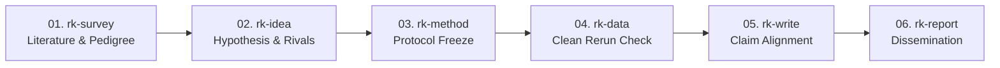

# Research Kit: The Comprehensive Operational Guide & Skills Handbook

**A complete, end-to-end practical guide for conducting empirical, reproducible scientific research with AI coding and research agents using Research Kit.**

---

## Table of Contents

1. [Lifecycle Management: Installation, Updating & Uninstallation](#1-lifecycle-management-installation-updating--uninstallation)
   - [1.1 Installation Methods](#11-installation-methods)
   - [1.2 Updating Skills](#12-updating-skills)
   - [1.3 Uninstallation & Clean Reset](#13-uninstallation--clean-reset)
   - [1.4 Integrity Verification & Health Check](#14-integrity-verification--health-check)
   - [1.5 Agent Cache & Session Reloading](#15-agent-cache--session-reloading)
2. [Multiple Papers in One Repo & Evidence Boundaries](#2-multiple-papers-in-one-repo--evidence-boundaries)
   - [2.1 Directory Blueprint](#21-directory-blueprint)
   - [2.2 Active Paper Resolution Protocol](#22-active-paper-resolution-protocol)
   - [2.3 Audited Read-Only Literature Shelf](#23-audited-read-only-literature-shelf)
3. [Per-Skill Operational Reference (10 Skills)](#3-per-skill-operational-reference-10-skills)
   - [Part 1: The 6-Stage Core Paper Pipeline](#part-1-the-6-stage-core-paper-pipeline)
     - [01. rk-survey: Literature Survey & Provenance](#01-rk-survey-literature-survey--provenance)
     - [02. rk-idea: Hypothesis & Rival Falsification](#02-rk-idea-hypothesis--rival-falsification)
     - [03. rk-method: Methodology & Protocol Freeze](#03-rk-method-methodology--protocol-freeze)
     - [04. rk-data: Raw Data & Rerun Verification](#04-rk-data-raw-data--rerun-verification)
     - [05. rk-write: Structured Manuscript Drafting](#05-rk-write-structured-manuscript-drafting)
     - [06. rk-report: Dissemination & Progress Debriefs](#06-rk-report-dissemination--progress-debriefs)
   - [Part 2: The 4 Specialist Domain Extensions](#part-2-the-4-specialist-domain-extensions)
     - [07. rk-quantum: Quantum Computing Simulation](#07-rk-quantum-quantum-computing-simulation)
     - [08. rk-quantum-network: Quantum Network Protocols](#08-rk-quantum-network-quantum-network-protocols)
     - [09. rk-ai: Machine Learning Evaluation & Integrity](#09-rk-ai-machine-learning-evaluation--integrity)
     - [10. rk-academic-visualize: Scientific Figures & Presentations](#10-rk-academic-visualize-scientific-figures--presentations)
4. [End-to-End Scientific Playbook (From Idea to Publication)](#4-end-to-end-scientific-playbook-from-idea-to-publication)
5. [Quick Decision Matrix & Prompt Cheatsheet](#5-quick-decision-matrix--prompt-cheatsheet)
6. [Anti-Patterns & Critical Safeguards](#6-anti-patterns--critical-safeguards)

---

## 1. Lifecycle Management: Installation, Updating & Uninstallation

Research Kit strictly complies with the [Agent Skills specification](https://agentskills.io/specification). Skills are pure procedural Markdown instructions—adding zero third-party Python dependencies, background daemons, or brittle session hooks.

### 1.1 Installation Methods

#### Method A: Skills CLI (Recommended by Vercel Labs)
The official Skills CLI manages skills in standard agent environments with automatic detection:
```bash
# Install the complete 10-skill suite from GitHub
npx skills add vinhnt21/research-kit

# Or install a specific individual skill
npx skills add vinhnt21/research-kit --skill rk-ai
```

#### Method B: GitHub CLI (`gh skill` — v2.90.0+)
Native integration into AI agent profiles:
```bash
# Target Cursor IDE
gh skill install vinhnt21/research-kit --agent cursor

# Or target other supported environments:
gh skill install vinhnt21/research-kit --agent claude-code
gh skill install vinhnt21/research-kit --agent codex
gh skill install vinhnt21/research-kit --agent antigravity

# Optional scope: --scope user (default, global) or --scope project (local to repo)
```

#### Method C: Agent-Assisted Installation (Zero-Terminal via ZIP)
1. Download the repository archive: [`research-kit-main.zip`](https://github.com/vinhnt21/research-kit/archive/refs/heads/main.zip).
2. Prompt your agent (Cursor Composer, Claude Code, Codex, Antigravity):
   ```text
   Extract the downloaded research-kit-main.zip and copy all subdirectories from skills/rk-* into your skills directory (~/.cursor/skills/, ~/.claude/skills/, ~/.codex/skills/, or ~/.agents/skills/).
   ```

#### Method D: Manual Filesystem Clone
Clone the repository and copy the `skills/rk-*` directories directly into your target agent's configured path:
```bash
git clone https://github.com/vinhnt21/research-kit.git

# Cursor
cp -r research-kit/skills/rk-* ~/.cursor/skills/

# Claude Code
cp -r research-kit/skills/rk-* ~/.claude/skills/

# Codex
cp -r research-kit/skills/rk-* ${CODEX_HOME:-$HOME/.codex}/skills/

# Antigravity / Gemini CLI / Universal Agent
cp -r research-kit/skills/rk-* ~/.agents/skills/
```

---

### 1.2 Updating Skills

When upstream skills receive improvements, bug fixes, or new empirical checks, refresh your local copies using the tool you originally installed with:

#### With Skills CLI (`npx skills`)
```bash
# Check and update all installed skills across all agents
npx skills update
# (Alias: npx skills upgrade)

# Unattended update (skips interactive confirmation prompts)
npx skills update -y

# Update a single skill specifically
npx skills update rk-survey
```

#### With GitHub CLI (`gh skill`)
```bash
# Preview changes before applying (Dry Run)
gh skill update --dry-run

# Update all installed skills
gh skill update --all

# Update only a specific skill
gh skill update rk-data
```

#### Manual Update (Git Pull)
If you installed manually via Git clone:
```bash
cd research-kit && git pull origin main
# Re-copy the updated skills to your agent's directory
cp -r skills/rk-* ~/.cursor/skills/  # Adjust for your agent
```

---

### 1.3 Uninstallation & Clean Reset

#### With Skills CLI
Skills CLI provides built-in removal commands:
```bash
# Interactive skill selection
npx skills remove

# Remove specific skills directly without prompt
npx skills remove rk-quantum rk-quantum-network -y

# Verify remaining installed skills
npx skills list
```

#### With GitHub CLI (`gh skill`)
> [!IMPORTANT]
> As of GitHub CLI v2.90+, `gh skill` does **not** yet have an official `gh skill remove` or `gh skill uninstall` command (tracked under GitHub CLI Issue #13706).
> 
> To remove skills installed via `gh skill`, follow the official maintainer guidance:
> 1. List the exact install locations:
>    ```bash
>    gh skill list --json name,path
>    ```
> 2. Delete the specific skill directory with your system's remove command:
>    ```bash
>    rm -rf <path_to_skill_folder>
>    ```

#### Manual Clean Removal
To remove all Research Kit skills completely from your agent:
```bash
# Cursor
rm -rf ~/.cursor/skills/rk-*

# Claude Code
rm -rf ~/.claude/skills/rk-*

# Codex
rm -rf ${CODEX_HOME:-$HOME/.codex}/skills/rk-*

# Antigravity / Universal
rm -rf ~/.agents/skills/rk-*
```

---

### 1.4 Integrity Verification & Health Check

Research Kit includes a deterministic test suite to verify skill integrity, frontmatter bounds, and local link graphs. Run this anytime after installing, updating, or editing skills:
```bash
python3 scripts/check-suite.py
```
A successful check will output:
```text
All 10 skills verified successfully.
Standing context footprint: < 1,000 tokens (< 0.50% of 200k window).
No broken relative references detected.
```

---

### 1.5 Agent Cache & Session Reloading

Under the Agent Skills specification, agents parse `SKILL.md` frontmatter (`name` and `description`) **once during session initialization**.
* **After updating or deleting skills**, your active agent conversation may still retain the old instructions in memory.
* **Always restart your agent or open a fresh chat session** after updating or removing skills so the agent indexes the refreshed configuration cleanly.

---

## 2. Multiple Papers in One Repo & Evidence Boundaries

In scientific research, a single lab repository frequently hosts multiple concurrent investigations, sibling drafts, or exploratory experiments. Without clear evidence boundaries between papers in the same repo, AI agents routinely cause cross-contamination: citing draft numbers from an unrelated paper, confusing experimental baselines, or importing unverified claims.

### 2.1 Directory Blueprint

Research Kit establishes clear evidence boundaries:

```text
my-research-lab/                # Root Repository
├── AGENTS.md                   # Global lab conventions, coding standards, environment notes
├── literature/                 # Centralized Reference Library (AUDITED READ-ONLY)
│   ├── references.bib          # Universal verified BibTeX repository
│   └── pdfs/                   # Downloaded source preprints and PDFs
│
├── papers/                     # Independent, Partitioned Paper Workspaces
│   ├── 2026-vqe-optimization/  # [Active Paper 1]
│   │   ├── AGENTS.md           # Active Paper Declaration (Scope, Questions, Hypotheses)
│   │   ├── src/                # Dedicated experimental scripts for Paper 1
│   │   ├── data/               # Dedicated raw data & independent rerun verification logs
│   │   ├── figures/            # Generated publication figures for Paper 1
│   │   └── manuscript/         # LaTeX / Markdown manuscript source files
│   │
│   └── 2026-routing-protocol/  # [Active Paper 2] - Separate workspace in the same repo
│       ├── AGENTS.md           # Active Paper Declaration for Paper 2
│       ├── src/
│       ├── data/
│       ├── figures/
│       └── manuscript/
│
└── shared/                     # (Optional) Verified common math libraries or plotting utilities
```

### 2.2 Active Paper Resolution Protocol

Every Research Kit skill strictly enforces the **Active Paper Resolution Rule**:
1. **Resolution**: The agent must determine which paper is active from the user prompt, current working directory (`cwd`), or the local `AGENTS.md`.
2. **Ambiguity Check**: If multiple papers exist and the task involves writing, running code, or making scientific claims, the agent **must ask for clarification** before proceeding.
3. **Absolute Evidence Boundary**:
   - Files, scripts, and drafts in sibling paper directories in the same repo (`papers/2026-routing-protocol/`) are **strictly prohibited** from serving as baselines, citations, or evidence for `papers/2026-vqe-optimization/`.
   - Never copy uncommitted exploratory data across papers in the same repository.

### 2.3 Audited Read-Only Literature Shelf

The centralized `literature/` folder provides a shared repository of references, but:
- It is strictly **read-only**.
- Any reference retrieved from `literature/` must undergo independent provenance verification for the active paper's specific claims (via `rk-survey`).

---

## 3. Per-Skill Operational Reference (10 Skills)

### Part 1: The 6-Stage Core Paper Pipeline



---

#### 01. rk-survey: Literature Survey & Provenance
* **Location**: [`skills/rk-survey/SKILL.md`](file:///Users/vinhnt/DATA/learning/research-skills/skills/rk-survey/SKILL.md)
* **Stage**: Stage 01 (Survey & Prior Art)
* **Scope & Duty**: Systematic literature boundary specification, citation validation, retraction checking, and evidence mapping.
* **When to Use**:
  - Reviewing existing literature on a scientific topic.
  - Verifying if cited papers are genuine, published, and not hallucinated.
  - Creating an evidence map before formulating a new hypothesis.
* **When NOT to Use**:
  - Do NOT use for hypothesis ranking (use `rk-idea`).
  - Do NOT use for experimental protocol design (use `rk-method`).
  - Do NOT use for writing paper prose or introductions (use `rk-write`).
* **Input Prerequisites**: Active paper context, topic keywords, or reference files in `literature/references.bib`.
* **Output Artifacts**:
  - Filled search boundary record: `assets/search-record.md`
  - Per-paper citation checks: `assets/citation-checklist.md`
  - Grouped evidence map.
* **Mandatory Quality Gate**:
  - *Hard Stop*: Search boundary locked with explicit inclusion and stopping rules. Every load-bearing source must have verified DOI/venue/status. Zero hallucinated citations allowed.
* **Sample Trigger Prompts**:
  - **EN**: `"Run @rk-survey to map recent literature on quantum repeater placement. Complete a citation check on the top 5 baseline papers."`
  - **VI**: `"Dùng @rk-survey để khảo sát tài liệu về quantum repeater. Kiểm tra nguồn gốc và lập checklist trích dẫn cho 5 bài báo nền tảng."`
* **Companion References**:
  - [`references/search-boundary.md`](file:///Users/vinhnt/DATA/learning/research-skills/skills/rk-survey/references/search-boundary.md)
  - [`references/citation-check.md`](file:///Users/vinhnt/DATA/learning/research-skills/skills/rk-survey/references/citation-check.md)
  - [`references/evidence-map.md`](file:///Users/vinhnt/DATA/learning/research-skills/skills/rk-survey/references/evidence-map.md)

---

#### 02. rk-idea: Hypothesis & Rival Falsification
* **Location**: [`skills/rk-idea/SKILL.md`](file:///Users/vinhnt/DATA/learning/research-skills/skills/rk-idea/SKILL.md)
* **Stage**: Stage 02 (Hypothesis Formulation)
* **Scope & Duty**: Research question framing, rival explanations matrix, falsification criteria, and cognitive bias audits.
* **When to Use**:
  - Brainstorming and refining scientific questions.
  - Subjecting ideas to adversarial stress-testing.
  - Deciding whether to proceed with an idea before allocating compute.
* **When NOT to Use**:
  - Do NOT use for searching literature (use `rk-survey`).
  - Do NOT use for writing code or benchmarks (use `rk-method` / `rk-ai`).
* **Input Prerequisites**: Evidence map or problem statement from `rk-survey`.
* **Output Artifacts**:
  - Hypothesis record: `assets/hypothesis-record.md`
  - Rival hypothesis matrix: `assets/rival-matrix.md`
  - Explicit Pursue / Kill decision log.
* **Mandatory Quality Gate**:
  - *Hard Stop*: Falsification criteria must be specified *before* running experiments. A clear Pursue / Kill decision matrix must be signed off.
* **Sample Trigger Prompts**:
  - **EN**: `"Use @rk-idea to stress-test our hypothesis regarding neural network pruning efficiency against 3 rival baseline explanations."`
  - **VI**: `"Gọi @rk-idea để đánh giá giả thuyết về tối ưu hóa mạng nơ-ron và lập ma trận giả thuyết đối thủ kèm điều kiện bác bỏ."`
* **Companion References**:
  - [`references/framing.md`](file:///Users/vinhnt/DATA/learning/research-skills/skills/rk-idea/references/framing.md)
  - [`references/hypothesis-quality.md`](file:///Users/vinhnt/DATA/learning/research-skills/skills/rk-idea/references/hypothesis-quality.md)
  - [`references/rivals-and-falsification.md`](file:///Users/vinhnt/DATA/learning/research-skills/skills/rk-idea/references/rivals-and-falsification.md)
  - [`references/biases-and-fallacies.md`](file:///Users/vinhnt/DATA/learning/research-skills/skills/rk-idea/references/biases-and-fallacies.md)

---

#### 03. rk-method: Methodology & Protocol Freeze
* **Location**: [`skills/rk-method/SKILL.md`](file:///Users/vinhnt/DATA/learning/research-skills/skills/rk-method/SKILL.md)
* **Stage**: Stage 03 (Experimental Protocol)
* **Scope & Duty**: Experimental design, baseline selection, statistical power analysis, and compute budget calculation.
* **When to Use**:
  - Designing an experimental trial, benchmark, or simulation.
  - Establishing baseline comparison controls.
  - Freezing experimental protocol to prevent post-hoc p-hacking.
* **When NOT to Use**:
  - Do NOT use for analyzing experimental output data (use `rk-data`).
  - Do NOT use for writing paper abstracts or conclusions (use `rk-write`).
* **Input Prerequisites**: Validated hypothesis from `rk-idea`.
* **Output Artifacts**:
  - Method plan & freeze document: `assets/method-plan.md`
* **Mandatory Quality Gate**:
  - *Hard Stop*: Protocol Freeze. Experimental variables, statistical tests, metrics, and stopping criteria must be documented before executing scripts.
* **Sample Trigger Prompts**:
  - **EN**: `"Apply @rk-method to design the benchmark protocol for our routing algorithm. Calculate required sample size and freeze protocol."`
  - **VI**: `"Dùng @rk-method để thiết kế thí nghiệm benchmark thuật toán định tuyến, tính toán compute budget và đóng băng giao thức."`
* **Companion References**:
  - [`references/design-choice.md`](file:///Users/vinhnt/DATA/learning/research-skills/skills/rk-method/references/design-choice.md)
  - [`references/power-and-precision.md`](file:///Users/vinhnt/DATA/learning/research-skills/skills/rk-method/references/power-and-precision.md)
  - [`references/feasibility-and-freeze.md`](file:///Users/vinhnt/DATA/learning/research-skills/skills/rk-method/references/feasibility-and-freeze.md)

---

#### 04. rk-data: Raw Data & Rerun Verification
* **Location**: [`skills/rk-data/SKILL.md`](file:///Users/vinhnt/DATA/learning/research-skills/skills/rk-data/SKILL.md)
* **Stage**: Stage 04 (Data Processing & Rerun)
* **Scope & Duty**: Raw data inspection, distribution sanity checks, hypothesis testing, anomaly diagnosis, and independent clean rerun verification.
* **When to Use**:
  - Inspecting raw CSV/HDF5/JSON experimental logs.
  - Running ANOVA, t-tests, Mann-Whitney U tests, or confidence interval calculations.
  - Diagnosing outliers and running clean data verification.
* **When NOT to Use**:
  - Do NOT use for modifying the frozen protocol (use `rk-method`).
  - Do NOT use for drafting paper text (use `rk-write`).
* **Input Prerequisites**: Frozen method plan (`method-plan.md`) and raw data files in `data/`.
* **Output Artifacts**:
  - Analysis record: `assets/analysis-record.md`
  - Rerun log verifying identical reproducibility from raw data.
  - Publication figures conforming to statistical visual standards.
* **Mandatory Quality Gate**:
  - *Hard Stop*: Mandatory fresh rerun check. No scientific claim or summary figure is accepted without an end-to-end execution log reproducing the values from raw data.
* **Sample Trigger Prompts**:
  - **EN**: `"Run @rk-data to inspect raw data in data/run-01/, test for statistical significance, and verify clean rerun reproducibility."`
  - **VI**: `"Gọi @rk-data để kiểm tra phân phối dữ liệu thô, thực hiện kiểm định thống kê và chạy rerun độc lập từ raw data."`
* **Companion References**:
  - [`references/inspect.md`](file:///Users/vinhnt/DATA/learning/research-skills/skills/rk-data/references/inspect.md)
  - [`references/test-choice.md`](file:///Users/vinhnt/DATA/learning/research-skills/skills/rk-data/references/test-choice.md)
  - [`references/figures.md`](file:///Users/vinhnt/DATA/learning/research-skills/skills/rk-data/references/figures.md)
  - [`references/anomalies-and-rerun.md`](file:///Users/vinhnt/DATA/learning/research-skills/skills/rk-data/references/anomalies-and-rerun.md)

---

#### 05. rk-write: Structured Manuscript Drafting
* **Location**: [`skills/rk-write/SKILL.md`](file:///Users/vinhnt/DATA/learning/research-skills/skills/rk-write/SKILL.md)
* **Stage**: Stage 05 (Manuscript Authoring)
* **Scope & Duty**: Structured academic paper writing, single-core-idea paragraph flow, claim-to-evidence alignment audit, reviewer rebuttal drafting.
* **When to Use**:
  - Drafting Abstract, Introduction, Methods, Results, Discussion.
  - Reviewing manuscript drafts for claim-evidence consistency.
  - Writing formal rebuttals and point-by-point author responses to peer reviewers.
* **When NOT to Use**:
  - Do NOT use for data analysis or recalculating stats (use `rk-data`).
  - Do NOT use for making slides or executive briefings (use `rk-report`).
* **Input Prerequisites**: Verified data records (`analysis-record.md`), frozen method (`method-plan.md`), and checked citations (`search-record.md`).
* **Output Artifacts**:
  - Manuscript sections (`manuscript/*.tex` or `*.md`)
  - Claim-to-evidence audit log: `assets/claim-evidence.md`
  - Formal peer-review rebuttal responses.
* **Mandatory Quality Gate**:
  - *Hard Stop*: 100% claim-to-evidence audit. Every claim, number, and percentage in the manuscript must map directly to a verified rerun artifact or cited reference.
* **Sample Trigger Prompts**:
  - **EN**: `"Use @rk-write to draft Section 4 (Results). Ensure each paragraph has exactly one core idea and audit claims against analysis-record.md."`
  - **VI**: `"Dùng @rk-write soạn thảo phần Kết quả (Results). Tuân thủ nguyên tắc 1 ý/đoạn và kiểm toán 100% số liệu so với bằng chứng thực nghiệm."`
* **Companion References**:
  - [`references/claim-evidence.md`](file:///Users/vinhnt/DATA/learning/research-skills/skills/rk-write/references/claim-evidence.md)
  - [`references/section-roles.md`](file:///Users/vinhnt/DATA/learning/research-skills/skills/rk-write/references/section-roles.md)
  - [`references/paragraph-flow.md`](file:///Users/vinhnt/DATA/learning/research-skills/skills/rk-write/references/paragraph-flow.md)
  - [`references/review-and-response.md`](file:///Users/vinhnt/DATA/learning/research-skills/skills/rk-write/references/review-and-response.md)

---

#### 06. rk-report: Dissemination & Progress Debriefs
* **Location**: [`skills/rk-report/SKILL.md`](file:///Users/vinhnt/DATA/learning/research-skills/skills/rk-report/SKILL.md)
* **Stage**: Stage 06 (Dissemination & Reporting)
* **Scope & Duty**: Lab meeting debriefs, executive summaries, defense presentations, and stakeholder reports.
* **When to Use**:
  - Preparing weekly research progress updates for lab directors or advisors.
  - Summarizing paper contributions for grant reports or executive stakeholders.
  - Creating presentation outlines for thesis defenses or conference talks.
* **When NOT to Use**:
  - Do NOT use for rendering TikZ or vector architecture figures (use `rk-academic-visualize`).
  - Do NOT use for ungrounded marketing claims.
* **Input Prerequisites**: Completed manuscript, analysis record, or milestone outcomes.
* **Output Artifacts**:
  - Progress debrief report: `assets/report-record.md`
  - Executive briefing document.
* **Mandatory Quality Gate**:
  - *Hard Stop*: Reporting gate strictly restricted to empirically verified results. Speculations must be explicitly labeled.
* **Sample Trigger Prompts**:
  - **EN**: `"Use @rk-report to prepare a 2-page executive briefing for our lab meeting, summarizing validated findings and remaining milestones."`
  - **VI**: `"Gọi @rk-report lập báo cáo tiến độ tuần cho buổi họp lab, chỉ đưa vào các kết quả đã qua cổng kiểm chứng thực nghiệm."`
* **Companion References**:
  - [`references/report-gate.md`](file:///Users/vinhnt/DATA/learning/research-skills/skills/rk-report/references/report-gate.md)

---

### Part 2: The 4 Specialist Domain Extensions

---

#### 07. rk-quantum: Quantum Computing Simulation
* **Location**: [`skills/rk-quantum/SKILL.md`](file:///Users/vinhnt/DATA/learning/research-skills/skills/rk-quantum/SKILL.md)
* **Domain**: Quantum Algorithms & Simulation
* **Scope & Duty**: Hamiltonian modeling, circuit simulation, variational algorithms (VQE, QAOA), quantum state tomography.
* **Key Invariant**: **Local simulation by default**. Physical cloud QPU execution strictly requires explicit budget authorization from the researcher.
* **Sample Trigger Prompts**:
  - **EN**: `"Use @rk-quantum to build a local statevector simulation of a 12-qubit Heisenberg Hamiltonian using Qiskit."`
  - **VI**: `"Dùng @rk-quantum để mô phỏng cục bộ thuật toán VQE cho phân tử LiH, ghi lại năng lượng trạng thái đáy."`

---

#### 08. rk-quantum-network: Quantum Network Protocols
* **Location**: [`skills/rk-quantum-network/SKILL.md`](file:///Users/vinhnt/DATA/learning/research-skills/skills/rk-quantum-network/SKILL.md)
* **Domain**: Quantum Networks & Distributed Systems
* **Scope & Duty**: Entanglement distribution, repeater memory management, routing protocols, Bell-state fidelity tracking.
* **Key Invariant**: State verification and fidelity threshold bounds must be verified before reporting routing throughput.
* **Sample Trigger Prompts**:
  - **EN**: `"Use @rk-quantum-network to simulate entanglement swapping across a 5-node linear repeater chain and compute end-to-end fidelity."`
  - **VI**: `"Gọi @rk-quantum-network để mô phỏng giao thức định tuyến mạng lượng tử và đánh giá độ suy giảm fidelity qua repeater."`

---

#### 09. rk-ai: Machine Learning Evaluation & Integrity
* **Location**: [`skills/rk-ai/SKILL.md`](file:///Users/vinhnt/DATA/learning/research-skills/skills/rk-ai/SKILL.md)
* **Domain**: Artificial Intelligence & Machine Learning
* **Scope & Duty**: Strict train/validation/test splitting, data leakage audits, deterministic random seeds, baseline parity.
* **Key Invariant**: Zero data leakage. Any transformation or normalization must be fit strictly on training data alone.
* **Sample Trigger Prompts**:
  - **EN**: `"Run @rk-ai to audit our data preprocessing pipeline for temporal leakage and verify fixed seed reproducibility across 5 runs."`
  - **VI**: `"Dùng @rk-ai kiểm toán pipeline tiền xử lý để đảm bảo không bị data leakage giữa tập train/test và kiểm tra seed cố định."`

---

#### 10. rk-academic-visualize: Scientific Figures & Presentations
* **Location**: [`skills/rk-academic-visualize/SKILL.md`](file:///Users/vinhnt/DATA/learning/research-skills/skills/rk-academic-visualize/SKILL.md)
* **Domain**: Academic Graphics & Slides
* **Scope & Duty**: Publication-grade LaTeX TikZ architecture diagrams, clean SVG/Mermaid flowcharts, anti-overlap arrow geometry, slide deck design.
* **Key Invariant**: Keep figures easy to read — few boxes and labels, orthogonal arrows with at most two bends, no arrow over text; slides may only state claims already grounded in the paper.
* **Sample Trigger Prompts**:
  - **EN**: `"Use @rk-academic-visualize to generate a publication-grade LaTeX TikZ diagram illustrating our system architecture with clean orthogonal arrows."`
  - **VI**: `"Dùng @rk-academic-visualize để vẽ sơ đồ kiến trúc hệ thống bằng LaTeX TikZ chuẩn bài báo IEEE, đảm bảo mũi tên không đè lên khối."`

---

## 4. End-to-End Scientific Playbook (From Idea to Publication)

Here is how a researcher moves through an entire scientific paper lifecycle with Research Kit:

```text
Week 1: Literature Foundation
└── @rk-survey
    ├── Inputs: Research topic & keywords
    ├── Action: Screens sources, checks retractions, maps prior art
    └── Gate Passed: assets/search-record.md filled with verified DOIs

Week 2: Idea Stress-Testing
└── @rk-idea
    ├── Inputs: Evidence map & gaps from survey
    ├── Action: Formulates primary question, drafts rival matrix
    └── Gate Passed: assets/rival-matrix.md signed off with falsification criteria

Week 3: Protocol Freeze
└── @rk-method
    ├── Inputs: Validated hypothesis
    ├── Action: Defines sample size, power analysis, metrics, baseline controls
    └── Gate Passed: assets/method-plan.md FROZEN before compute execution

Week 4: Execution & Rerun
└── @rk-ai / @rk-quantum + @rk-data
    ├── Action: Model training / simulation executed
    ├── Verification: Independent fresh rerun check directly from raw logs
    └── Gate Passed: assets/analysis-record.md generated with clean rerun logs

Week 5: Manuscript Drafting
└── @rk-write
    ├── Inputs: Verified analysis records + frozen method plan
    ├── Action: Drafts sections (1 idea/paragraph)
    └── Gate Passed: 100% claim-to-evidence audit in assets/claim-evidence.md

Week 6: Presentation & Dissemination
└── @rk-academic-visualize + @rk-report
    ├── Action: Generates TikZ architecture figures and defense slide decks
    └── Gate Passed: Clear presentation grounded solely in audited results
```

---

## 5. Quick Decision Matrix & Prompt Cheatsheet

| If you are trying to... | Call this Skill | Sample Trigger Command |
| :--- | :--- | :--- |
| Check if a paper exists or is retracted | `rk-survey` | `"@rk-survey audit citation pedigree for [DOI/Title]"` |
| Map literature on a scientific topic | `rk-survey` | `"@rk-survey map evidence and boundaries for [Topic]"` |
| Frame research questions & test against rivals | `rk-idea` | `"@rk-idea evaluate hypothesis and build rival matrix for [Problem]"` |
| Design an experiment & prevent p-hacking | `rk-method` | `"@rk-method design benchmark protocol and freeze method for [Model]"` |
| Inspect raw data & run significance tests | `rk-data` | `"@rk-data test significance and run clean rerun on [data/path]"` |
| Draft a paper section (Intro, Results, etc.) | `rk-write` | `"@rk-write draft Section 3 with 1 core idea per paragraph"` |
| Respond to critical peer reviewers | `rk-write` | `"@rk-write draft point-by-point rebuttal to Reviewer 2 comment [text]"` |
| Create a lab meeting progress update | `rk-report` | `"@rk-report generate executive progress debrief from [paper-path]"` |
| Simulate a quantum circuit or VQE locally | `rk-quantum` | `"@rk-quantum run local statevector simulation of [Hamiltonian]"` |
| Simulate repeater routing & fidelity | `rk-quantum-network` | `"@rk-quantum-network evaluate entanglement distribution fidelity"` |
| Audit ML data splits for data leakage | `rk-ai` | `"@rk-ai audit dataset preprocessing for train/test leakage"` |
| Draw a publication-grade TikZ/SVG architecture | `rk-academic-visualize` | `"@rk-academic-visualize create LaTeX TikZ diagram with orthogonal arrows"` |

---

## 6. Anti-Patterns & Critical Safeguards

### Anti-Pattern 1: Hallucinated Citations
* **Problem**: AI models generate plausible-sounding author names and journal titles that do not exist.
* **Research Kit Safeguard**: `rk-survey` enforces a mandatory DOI and venue check. A reference is never cited unless its identifier successfully resolves to verified text.

### Anti-Pattern 2: Post-Hoc P-Hacking & HARKing
* **Problem**: Hypothesizing After Results are Known (HARKing) and modifying metrics until p < 0.05.
* **Research Kit Safeguard**: `rk-method` requires a **Protocol Freeze** (`method-plan.md`) signed off *before* data analysis scripts are executed.

### Anti-Pattern 3: Context Window Exhaustion
* **Problem**: Massive 160+ skill catalogs occupy >14,000 standing tokens (over 7% of context) before reading your first file.
* **Research Kit Safeguard**: Research Kit limits standing metadata to <1,000 tokens (<0.50% footprint), reserving >99.5% of model context for papers, raw data, and code.

### Anti-Pattern 4: Multi-Paper Cross-Contamination
* **Problem**: AI agent working on Paper A accidentally reuses exploratory, uncommitted metrics from Paper B in the same git repository.
* **Research Kit Safeguard**: Strict Active Paper Resolution via `AGENTS.md` keeps evidence boundaries between `papers/<paper-id>/` workspaces in the same repo.
