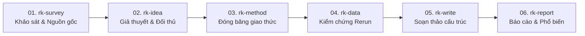

# Research Kit: Cẩm Nang Vận Hành & Hướng Dẫn Kỹ Thuật Toàn Diện

**Tài liệu hướng dẫn thực chiến từ A–Z về quy trình nghiên cứu khoa học có thể tái lập (reproducible research) cùng AI coding và research agent bằng bộ kỹ năng Research Kit.**

---

## Mục Lục

1. [Quản trị vòng đời: Cài đặt, Cập nhật & Gỡ bỏ](#1-quản-trị-vòng-đời-cài-đặt-cập-nhật--gỡ-bỏ)
   - [1.1 Các phương thức cài đặt](#11-các-phương-thức-cài-đặt)
   - [1.2 Cập nhật kỹ năng](#12-cập-nhật-kỹ-năng)
   - [1.3 Gỡ bỏ & Cài đặt lại sạch sẽ (Uninstall)](#13-gỡ-bỏ--cài-đặt-lại-sạch-sẽ-uninstall)
   - [1.4 Kiểm tra tính toàn vẹn (Health Check)](#14-kiểm-tra-tính-toàn-vẹn-health-check)
   - [1.5 Bộ nhớ đệm của Agent & Khởi động lại phiên làm việc](#15-bộ-nhớ-đệm-của-agent--khởi-động-lại-phiên-làm-việc)
2. [Kiến trúc Repository Đa Bài Báo & Quy Tắc Cách Ly](#2-kiến-trúc-repository-đa-bài-báo--quy-tắc-cách-ly)
   - [2.1 Sơ đồ tổ chức thư mục chuẩn](#21-sơ-đồ-tổ-chức-thư-mục-chuẩn)
   - [2.2 Giao thức xác định bài báo hiện hành (Active Paper Declaration)](#22-giao-thức-xác-định-bài-báo-hiện-hành-active-paper-declaration)
   - [2.3 Kệ tài liệu dùng chung ở chế độ Chỉ Đọc (Read-Only)](#23-kệ-tài-liệu-dùng-chung-ở-chế-độ-chỉ-đọc-read-only)
3. [Sổ Tay Vận Hành Chi Tiết 10 Kỹ Năng](#3-sổ-tay-vận-hành-chi-tiết-10-kỹ-năng)
   - [Phần 1: Quy trình cốt lõi 6 giai đoạn](#phần-1-quy-trình-cốt-lõi-6-giai-đoạn)
     - [01. rk-survey: Khảo sát tài liệu & Xác minh nguồn gốc](#01-rk-survey-khảo-sát-tài-liệu--xác-minh-nguồn-gốc)
     - [02. rk-idea: Xây dựng giả thuyết & Đối lập bác bỏ](#02-rk-idea-xây-dựng-giả-thuyết--đối-lập-bác-bỏ)
     - [03. rk-method: Phương pháp luận & Đóng băng giao thức](#03-rk-method-phương-pháp-luận--đóng-băng-giao-thức)
     - [04. rk-data: Dữ liệu thô & Kiểm chứng chạy lại độc lập](#04-rk-data-dữ-liệu-thô--kiểm-chứng-chạy-lại-độc-lập)
     - [05. rk-write: Soạn thảo bản thảo cấu trúc](#05-rk-write-soạn-thảo-bản-thảo-cấu-trúc)
     - [06. rk-report: Báo cáo định kỳ & Phổ biến kết quả](#06-rk-report-báo-cáo-định-kỳ--phổ-biến-kết-quả)
   - [Phần 2: 4 Module chuyên ngành mở rộng](#phần-2-4-module-chuyên-ngành-mở-rộng)
     - [07. rk-quantum: Mô phỏng điện toán lượng tử](#07-rk-quantum-mô-phỏng-điện-toán-lượng-tử)
     - [08. rk-quantum-network: Giao thức mạng lượng tử](#08-rk-quantum-network-giao-thức-mạng-lượng-tử)
     - [09. rk-ai: Kiểm chuẩn học máy & Chống rò rỉ dữ liệu](#09-rk-ai-kiểm-chuẩn-học-máy--chống-rò-rỉ-dữ-liệu)
     - [10. rk-academic-visualize: Minh họa khoa học & Slide thuyết trình](#10-rk-academic-visualize-minh-họa-khoa-học--slide-thuyết-trình)
4. [Kịch Bản Thực Chiến Trọn Vẹn (Từ Ý Tưởng Đến Xuất Bản)](#4-kịch-bản-thực-chiến-trọn-vẹn-từ-ý-tưởng-đến-xuất-bản)
5. [Bảng Tra Cứu Nhanh & Mẫu Prompt Thực Chiến](#5-bảng-tra-cứu-nhanh--mẫu-prompt-thực-chiến)
6. [Các Cạm Bẫy (Anti-Patterns) & Cơ Chế Phòng Vệ](#6-các-cạm-bẫy-anti-patterns--cơ-chế-phòng-vệ)

---

## 1. Quản trị vòng đời: Cài đặt, Cập nhật & Gỡ bỏ

Research Kit tuân thủ tuyệt đối quy chuẩn [Agent Skills specification](https://agentskills.io/specification). Toàn bộ kỹ năng là quy trình vận hành chuẩn (SOP) thuần văn bản Markdown—hoàn toàn không cài cắm script chạy ngầm, không yêu cầu biến môi trường API bí mật, không làm nặng máy.

### 1.1 Các phương thức cài đặt

#### Cách A: Skills CLI (Khuyên dùng từ Vercel Labs)
Bộ công cụ chuẩn hoá kỹ năng cho các AI coding agent:
```bash
# Cài đặt trọn bộ 10 kỹ năng từ GitHub
npx skills add vinhnt21/research-kit

# Hoặc cài đặt riêng một kỹ năng chỉ định
npx skills add vinhnt21/research-kit --skill rk-ai
```

#### Cách B: GitHub CLI (`gh skill` — v2.90.0+)
Tích hợp trực tiếp vào hồ sơ của từng Agent:
```bash
# Cài đặt cho Cursor IDE
gh skill install vinhnt21/research-kit --agent cursor

# Cài đặt cho các môi trường khác:
gh skill install vinhnt21/research-kit --agent claude-code
gh skill install vinhnt21/research-kit --agent codex
gh skill install vinhnt21/research-kit --agent antigravity

# Tùy chọn phạm vi: --scope user (mặc định, toàn cục) hoặc --scope project (cục bộ trong repo)
```

#### Cách C: Cài đặt tự động qua Agent (Zero-Terminal bằng file ZIP)
1. Tải file nén mã nguồn: [`research-kit-main.zip`](https://github.com/vinhnt21/research-kit/archive/refs/heads/main.zip).
2. Nhập lệnh yêu cầu Agent (Cursor Composer, Claude Code, Codex, Antigravity):
   ```text
   Giải nén file research-kit-main.zip đã tải và sao chép toàn bộ các thư mục con trong skills/rk-* vào thư mục kỹ năng của bạn (~/.cursor/skills/, ~/.claude/skills/, ~/.codex/skills/, hoặc ~/.agents/skills/).
   ```

#### Cách D: Sao chép thủ công từ Git Clone
Clone repository và chép trực tiếp các thư mục `skills/rk-*` vào thư mục của agent đích:
```bash
git clone https://github.com/vinhnt21/research-kit.git

# Cho Cursor
cp -r research-kit/skills/rk-* ~/.cursor/skills/

# Cho Claude Code
cp -r research-kit/skills/rk-* ~/.claude/skills/

# Cho Codex
cp -r research-kit/skills/rk-* ${CODEX_HOME:-$HOME/.codex}/skills/

# Cho Antigravity / Gemini CLI / Universal Agent
cp -r research-kit/skills/rk-* ~/.agents/skills/
```

---

### 1.2 Cập nhật kỹ năng

Khi bộ kỹ năng có cập nhật mới (sửa lỗi, bổ sung tiêu chuẩn kiểm chứng), bạn cập nhật bằng đúng công cụ đã dùng để cài:

#### Cập nhật bằng Skills CLI (`npx skills`)
```bash
# Quét và cập nhật toàn bộ skill đã cài đặt
npx skills update
# (hoặc alias: npx skills upgrade)

# Cập nhật tự động không cần hỏi xác nhận (unattended)
npx skills update -y

# Cập nhật riêng một skill cụ thể
npx skills update rk-survey
```

#### Cập nhật bằng GitHub CLI (`gh skill`)
```bash
# Xem trước các thay đổi trước khi cập nhật (Dry Run)
gh skill update --dry-run

# Cập nhật tất cả các skill
gh skill update --all

# Cập nhật riêng một skill
gh skill update rk-data
```

#### Cập nhật thủ công (Git Pull)
Nếu bạn cài bằng phương pháp clone:
```bash
cd research-kit && git pull origin main
# Chép đè lại thư mục kỹ năng vào agent của bạn
cp -r skills/rk-* ~/.cursor/skills/  # Đổi theo agent bạn đang dùng
```

---

### 1.3 Gỡ bỏ & Cài đặt lại sạch sẽ (Uninstall)

#### Với Skills CLI
Skills CLI hỗ trợ sẵn lệnh gỡ bỏ chính thức:
```bash
# Mở menu tương tác chọn skill cần gỡ
npx skills remove

# Gỡ bỏ trực tiếp các skill chỉ định
npx skills remove rk-quantum rk-quantum-network -y

# Xem lại danh sách các skill còn lại
npx skills list
```

#### Với GitHub CLI (`gh skill`)
> [!IMPORTANT]
> Đến phiên bản GitHub CLI v2.90+, `gh skill` **chưa có** lệnh `gh skill remove` hay `gh skill uninstall` chính thức (vấn đề đang được giải quyết ở GitHub CLI Issue #13706).
> 
> Hướng dẫn xử lý chính thức từ đội ngũ GitHub CLI:
> 1. Xem đường dẫn thư mục cài đặt thực tế:
>    ```bash
>    gh skill list --json name,path
>    ```
> 2. Dùng lệnh hệ điều hành để xoá thư mục skill đó:
>    ```bash
>    rm -rf <đường_dẫn_tới_thư_mục_skill>
>    ```

#### Gỡ bỏ thủ công hoàn toàn
Để dọn dẹp sạch toàn bộ các skill Research Kit khỏi agent của bạn:
```bash
# Cursor
rm -rf ~/.cursor/skills/rk-*

# Claude Code
rm -rf ~/.claude/skills/rk-*

# Codex
rm -rf ${CODEX_HOME:-$HOME/.codex}/skills/rk-*

# Antigravity / Universal
rm -rf ~/.agents/skills/rk-*
```

---

### 1.4 Kiểm tra tính toàn vẹn (Health Check)

Dự án tích hợp sẵn bộ kiểm tra tự động để xác minh cấu trúc frontmatter, định dạng liên kết và tính toàn vẹn của các file tham chiếu:
```bash
python3 scripts/check-suite.py
```
Nếu mọi thứ đạt chuẩn, bạn sẽ nhận được thông báo:
```text
All 10 skills verified successfully.
Standing context footprint: < 1,000 tokens (< 0.50% of 200k window).
No broken relative references detected.
```

---

### 1.5 Bộ nhớ đệm của Agent & Khởi động lại phiên làm việc

Theo quy chuẩn Agent Skills, các agent chỉ đọc metadata `name` và `description` từ file `SKILL.md` **một lần duy nhất khi khởi tạo phiên làm việc (Session Initialization)**.
* **Sau khi cập nhật hoặc xoá skill**, cửa sổ chat đang mở của agent vẫn có thể lưu giữ chỉ dẫn cũ trong bộ nhớ RAM.
* **Luôn tạo phiên chat mới (New Chat Session) hoặc khởi động lại Agent** sau khi update/xoá để đảm bảo agent nhận đúng phiên bản kỹ năng mới nhất.

---

## 2. Kiến trúc Repository Đa Bài Báo & Quy Tắc Cách Ly

Trong nghiên cứu thực tế, một repository thường lưu trữ nhiều hướng nghiên cứu song song, nhiều bài báo chị em hoặc các thí nghiệm thăm dò. Nếu không có ranh giới cách ly nghiêm ngặt, AI agent rất dễ gây ra **ô nhiễm chéo dữ liệu**: lấy số liệu nháp của bài A làm baseline cho bài B, trích dẫn bài chưa công bố hoặc nhập nhằng giữa các tập dữ liệu.

### 2.1 Sơ đồ tổ chức thư mục chuẩn

```text
my-research-lab/                # Kho lưu trữ gốc của Lab (1 Repository duy nhất)
├── AGENTS.md                   # Quy ước chung toàn lab, môi trường, chuẩn code
├── literature/                 # Thư viện tài liệu tham khảo chung (CHỈ ĐỌC / READ-ONLY)
│   ├── references.bib          # File BibTeX chứa trích dẫn đã được kiểm chứng
│   └── pdfs/                   # File PDF tài liệu gốc và preprint tải về
│
├── papers/                     # Không gian làm việc riêng biệt cho từng bài báo
│   ├── 2026-vqe-optimization/  # [Bài báo đang làm 1]
│   │   ├── AGENTS.md           # Tuyên bố Active Paper (Mục tiêu, câu hỏi nghiên cứu)
│   │   ├── src/                # Mã nguồn thí nghiệm riêng cho bài 1
│   │   ├── data/               # Dữ liệu thô & log kiểm chứng rerun riêng cho bài 1
│   │   ├── figures/            # Hình vẽ xuất bản tạo ra riêng cho bài 1
│   │   └── manuscript/         # Mã nguồn bản thảo bài báo (LaTeX / Markdown)
│   │
│   └── 2026-routing-protocol/  # [Bài báo đang làm 2] - Cách ly 100% với bài 1
│       ├── AGENTS.md           # Tuyên bố Active Paper riêng cho bài 2
│       ├── src/
│       ├── data/
│       ├── figures/
│       └── manuscript/
│
└── shared/                     # (Tùy chọn) Thư viện toán chung hoặc script vẽ biểu đồ
```

### 2.2 Giao thức xác định bài báo hiện hành (Active Paper Declaration)

Mọi kỹ năng trong Research Kit đều tuân thủ nguyên tắc **Active Paper Resolution**:
1. **Xác định bài báo**: Agent phải nhận diện bài báo đang thực hiện thông qua câu lệnh của người dùng, thư mục làm việc hiện hành (`cwd`), hoặc file `AGENTS.md` tại thư mục con đó.
2. **Hỏi lại khi chưa rõ**: Nếu repository có nhiều bài báo mà câu lệnh chưa xác định rõ đối tượng áp dụng, agent **bắt buộc phải dừng lại hỏi người dùng** trước khi sửa file, chạy code hoặc đưa ra nhận định khoa học.
3. **Cách ly tuyệt đối**:
   - File nháp, script và số liệu trong thư mục bài báo khác (`papers/2026-routing-protocol/`) **tuyệt đối không được dùng làm bằng chứng, baseline hay văn bản trích dẫn** cho bài báo hiện tại (`papers/2026-vqe-optimization/`).
   - Không tự tiện sao chép số liệu chưa commit giữa các bài báo.

### 2.3 Kệ tài liệu dùng chung ở chế độ Chỉ Đọc (Read-Only)

Thư mục `literature/` là nguồn tham khảo chung cho toàn dự án, nhưng:
- Luôn giữ ở chế độ **chỉ đọc**.
- Bất kỳ tài liệu nào lấy từ `literature/` khi đưa vào bài báo hiện hành đều phải trải qua bước kiểm tra nguồn gốc độc lập (thông qua kỹ năng `rk-survey`).

---

## 3. Sổ Tay Vận Hành Chi Tiết 10 Kỹ Năng

### Phần 1: Quy trình cốt lõi 6 giai đoạn



---

#### 01. rk-survey: Khảo sát tài liệu & Xác minh nguồn gốc
* **Đường dẫn**: [`skills/rk-survey/SKILL.md`](file:///Users/vinhnt/DATA/learning/research-skills/skills/rk-survey/SKILL.md)
* **Giai đoạn**: Giai đoạn 01 (Khảo sát tài liệu)
* **Mục đích & Ranh giới**: Xác định ranh giới tìm kiếm có hệ thống, thẩm định tính xác thực của tài liệu, kiểm tra tình trạng đính chính/rút bài (retraction), lập bản đồ chứng cứ khoa học.
* **Khi nào NÊN dùng**:
  - Khi bắt đầu tìm hiểu một chủ đề nghiên cứu mới.
  - Khi cần kiểm tra xem các trích dẫn có thật không, có bị AI bịa đặt không.
  - Khi xây dựng ma trận tổng hợp các phương pháp hiện có.
* **Khi nào KHÔNG ĐƯỢC dùng**:
  - Không dùng để chọn lọc/đánh giá ý tưởng (dùng `rk-idea`).
  - Không dùng để thiết kế phương pháp hay tính compute (dùng `rk-method`).
  - Không dùng để viết lời mở đầu bài báo (dùng `rk-write`).
* **Đầu vào cần chuẩn bị**: Từ khóa nghiên cứu, bối cảnh bài báo hiện hành, file `literature/references.bib`.
* **Sản phẩm đầu ra (Artifacts)**:
  - Bản ghi ranh giới tìm kiếm: `assets/search-record.md`
  - Phiếu kiểm tra trích dẫn từng bài: `assets/citation-checklist.md`
  - Bản đồ chứng cứ (Evidence Map).
* **Cổng nghiệm thu cứng (Quality Gate)**:
  - Khóa ranh giới tìm kiếm với quy tắc dừng (stop rule) rõ ràng. Mỗi tài liệu trích dẫn phải có DOI/venue/nguồn thật đã kiểm chứng. Tuyệt đối không có tài liệu ảo.
* **Mẫu câu lệnh kích hoạt (Trigger Prompts)**:
  - **VI**: `"Gọi @rk-survey để khảo sát tài liệu về định tuyến mạng lượng tử. Lập search-record và kiểm tra citation cho 5 bài báo nền tảng."`
  - **EN**: `"Run @rk-survey to map recent literature on quantum network routing and audit citations for 5 foundation papers."`
* **Tài liệu tham chiếu đi kèm**:
  - [`references/search-boundary.md`](file:///Users/vinhnt/DATA/learning/research-skills/skills/rk-survey/references/search-boundary.md)
  - [`references/citation-check.md`](file:///Users/vinhnt/DATA/learning/research-skills/skills/rk-survey/references/citation-check.md)
  - [`references/evidence-map.md`](file:///Users/vinhnt/DATA/learning/research-skills/skills/rk-survey/references/evidence-map.md)

---

#### 02. rk-idea: Xây dựng giả thuyết & Đối lập bác bỏ
* **Đường dẫn**: [`skills/rk-idea/SKILL.md`](file:///Users/vinhnt/DATA/learning/research-skills/skills/rk-idea/SKILL.md)
* **Giai đoạn**: Giai đoạn 02 (Hình thành giả thuyết)
* **Mục đích & Ranh giới**: Định hình câu hỏi nghiên cứu, lập ma trận giả thuyết đối thủ, xác định điều kiện bác bỏ (falsification criteria) và rà soát thiên kiến nhận thức.
* **Khi nào NÊN dùng**:
  - Khi cần biến một ý tưởng mơ hồ thành giả thuyết khoa học có thể kiểm chứng.
  - Khi cần phản biện và đối chiếu với các cách giải thích cạnh tranh khác.
  - Khi cần ra quyết định Tiếp tục hay Hủy bỏ (Pursue / Kill) trước khi tốn tài nguyên chạy thực nghiệm.
* **Khi nào KHÔNG ĐƯỢC dùng**:
  - Không dùng để tìm kiếm bài báo (dùng `rk-survey`).
  - Không dùng để viết code thực nghiệm hay chạy benchmark (dùng `rk-method` / `rk-ai`).
* **Đầu vào cần chuẩn bị**: Bản đồ chứng cứ hoặc khoảng trống nghiên cứu rút ra từ `rk-survey`.
* **Sản phẩm đầu ra**:
  - Hồ sơ giả thuyết: `assets/hypothesis-record.md`
  - Ma trận giả thuyết đối thủ: `assets/rival-matrix.md`
  - Biên bản quyết định Pursue / Kill.
* **Cổng nghiệm thu cứng (Quality Gate)**:
  - Bắt buộc phải xác định điều kiện bác bỏ (thế nào là thất bại) *trước khi* viết code. Ma trận quyết định phải được người nghiên cứu phê duyệt.
* **Mẫu câu lệnh kích hoạt**:
  - **VI**: `"Dùng @rk-idea để phản biện giả thuyết về thuật toán cắt tỉa mạng nơ-ron, lập ma trận đối thủ và chỉ rõ điều kiện bác bỏ."`
  - **EN**: `"Use @rk-idea to stress-test our neural pruning hypothesis against rival explanations and set explicit falsification rules."`
* **Tài liệu tham chiếu đi kèm**:
  - [`references/framing.md`](file:///Users/vinhnt/DATA/learning/research-skills/skills/rk-idea/references/framing.md)
  - [`references/hypothesis-quality.md`](file:///Users/vinhnt/DATA/learning/research-skills/skills/rk-idea/references/hypothesis-quality.md)
  - [`references/rivals-and-falsification.md`](file:///Users/vinhnt/DATA/learning/research-skills/skills/rk-idea/references/rivals-and-falsification.md)

---

#### 03. rk-method: Phương pháp luận & Đóng băng giao thức
* **Đường dẫn**: [`skills/rk-method/SKILL.md`](file:///Users/vinhnt/DATA/learning/research-skills/skills/rk-method/SKILL.md)
* **Giai đoạn**: Giai đoạn 03 (Thiết kế thực nghiệm)
* **Mục đích & Ranh giới**: Thiết kế thí nghiệm, lựa chọn baseline so sánh, phân tích thống kê độ mạnh (statistical power), tính toán ngân sách tính toán (compute budget) và **đóng băng giao thức (Protocol Freeze)** để chống p-hacking.
* **Khi nào NÊN dùng**:
  - Thiết kế quy trình thí nghiệm, cấu hình bộ đo, baseline đối chứng.
  - Tính toán số lượng mẫu tối thiểu cần thiết để đạt ý nghĩa thống kê.
  - Chốt cứng kế hoạch phân tích trước khi chạy máy.
* **Khi nào KHÔNG ĐƯỢC dùng**:
  - Không dùng để phân tích số liệu kết quả (dùng `rk-data`).
  - Không dùng để viết bản thảo bài báo (dùng `rk-write`).
* **Đầu vào cần chuẩn bị**: Giả thuyết đã được nghiệm thu từ `rk-idea`.
* **Sản phẩm đầu ra**:
  - Kế hoạch phương pháp & văn bản đóng băng: `assets/method-plan.md`
* **Cổng nghiệm thu cứng (Quality Gate)**:
  - **Đóng băng giao thức (Protocol Freeze)**: Các biến số, thước đo, phép kiểm định và tiêu chuẩn dừng phải được ghi nhận cố định trước khi chạy thực nghiệm.
* **Mẫu câu lệnh kích hoạt**:
  - **VI**: `"Gọi @rk-method để thiết kế thí nghiệm so sánh benchmark, tính toán power analysis và đóng băng file method-plan.md."`
  - **EN**: `"Run @rk-method to specify our benchmark protocol, compute required sample size, and freeze method-plan.md."`
* **Tài liệu tham chiếu đi kèm**:
  - [`references/design-choice.md`](file:///Users/vinhnt/DATA/learning/research-skills/skills/rk-method/references/design-choice.md)
  - [`references/power-and-precision.md`](file:///Users/vinhnt/DATA/learning/research-skills/skills/rk-method/references/power-and-precision.md)
  - [`references/feasibility-and-freeze.md`](file:///Users/vinhnt/DATA/learning/research-skills/skills/rk-method/references/feasibility-and-freeze.md)

---

#### 04. rk-data: Dữ liệu thô & Kiểm chứng chạy lại độc lập
* **Đường dẫn**: [`skills/rk-data/SKILL.md`](file:///Users/vinhnt/DATA/learning/research-skills/skills/rk-data/SKILL.md)
* **Giai đoạn**: Giai đoạn 04 (Xử lý dữ liệu & Rerun)
* **Mục đích & Ranh giới**: Kiểm tra chất lượng dữ liệu thô, thực hiện kiểm định thống kê, chẩn đoán ngoại lai (outliers), vẽ biểu đồ xuất bản và **kiểm chứng chạy lại độc lập (fresh rerun verification)**.
* **Khi nào NÊN dùng**:
  - Kiểm tra phân phối dữ liệu từ file log thực nghiệm (CSV/JSON/HDF5).
  - Thực hiện kiểm định t-test, ANOVA, Mann-Whitney U, tính khoảng tin cậy (CI).
  - Tái tạo lại toàn bộ bảng số liệu từ dữ liệu thô ban đầu để đảm bảo tính tái lập 100%.
* **Khi nào KHÔNG ĐƯỢC dùng**:
  - Không dùng để tự ý sửa đổi phương pháp đã đóng băng (dùng `rk-method`).
  - Không dùng để viết bài báo hoàn chỉnh (dùng `rk-write`).
* **Đầu vào cần chuẩn bị**: Kế hoạch phương pháp đã đóng băng (`method-plan.md`) và dữ liệu thô trong `data/`.
* **Sản phẩm đầu ra**:
  - Bản ghi phân tích dữ liệu: `assets/analysis-record.md`
  - Log xác nhận chạy lại độc lập (Rerun verification log).
  - Các hình vẽ kết quả đạt chuẩn xuất bản khoa học.
* **Cổng nghiệm thu cứng (Quality Gate)**:
  - **Bắt buộc kiểm chứng chạy lại độc lập**: Mọi kết luận khoa học và bảng biểu chỉ được công nhận sau khi có file log chứng minh việc tái tạo độc lập từ dữ liệu thô thành công.
* **Mẫu câu lệnh kích hoạt**:
  - **VI**: `"Dùng @rk-data kiểm tra phân phối dữ liệu thô tại data/run-01/, chạy kiểm định thống kê và thực hiện rerun độc lập."`
  - **EN**: `"Run @rk-data to inspect raw logs in data/run-01/, test statistical significance, and verify clean rerun reproducibility."`
* **Tài liệu tham chiếu đi kèm**:
  - [`references/inspect.md`](file:///Users/vinhnt/DATA/learning/research-skills/skills/rk-data/references/inspect.md)
  - [`references/test-choice.md`](file:///Users/vinhnt/DATA/learning/research-skills/skills/rk-data/references/test-choice.md)
  - [`references/figures.md`](file:///Users/vinhnt/DATA/learning/research-skills/skills/rk-data/references/figures.md)
  - [`references/anomalies-and-rerun.md`](file:///Users/vinhnt/DATA/learning/research-skills/skills/rk-data/references/anomalies-and-rerun.md)

---

#### 05. rk-write: Soạn thảo bản thảo cấu trúc
* **Đường dẫn**: [`skills/rk-write/SKILL.md`](file:///Users/vinhnt/DATA/learning/research-skills/skills/rk-write/SKILL.md)
* **Giai đoạn**: Giai đoạn 05 (Viết bản thảo & Rebuttal)
* **Mục đích & Ranh giới**: Soạn thảo các phần của bài báo theo kỷ luật học thuật: mỗi đoạn văn chỉ chứa đúng một ý cốt lõi (1 core idea/paragraph), đối chiếu 100% nhận định với bằng chứng thực nghiệm, soạn thảo thư phản hồi người bình duyệt (reviewer rebuttal).
* **Khi nào NÊN dùng**:
  - Viết bản thảo các mục Tóm tắt (Abstract), Giới thiệu (Intro), Phương pháp (Methods), Kết quả (Results), Thảo luận (Discussion).
  - Soát lỗi lập luận và kiểm tra tính nhất quán giữa tuyên bố và số liệu.
  - Soạn văn bản phản hồi từng điểm (point-by-point rebuttal) cho peer reviewer.
* **Khi nào KHÔNG ĐƯỢC dùng**:
  - Không dùng để tính toán lại số liệu thống kê (dùng `rk-data`).
  - Không dùng để thiết kế slide thuyết trình (dùng `rk-report`).
* **Đầu vào cần chuẩn bị**: Bản ghi phân tích dữ liệu (`analysis-record.md`), kế hoạch phương pháp (`method-plan.md`), và danh mục trích dẫn đã thẩm định (`search-record.md`).
* **Sản phẩm đầu ra**:
  - Các phần bản thảo (`manuscript/*.tex` hoặc `*.md`)
  - Bảng đối soát tuyên bố - bằng chứng: `assets/claim-evidence.md`
  - Văn bản phản hồi phản biện khoa học (Rebuttal response).
* **Cổng nghiệm thu cứng (Quality Gate)**:
  - **Kiểm toán 100% bằng chứng (Claim-to-Evidence Audit)**: Mỗi câu khẳng định, mỗi con số, mỗi phần trăm đưa vào bài báo phải dẫn xuất trực tiếp từ file log thực nghiệm đã rerun hoặc tài liệu trích dẫn thật.
* **Mẫu câu lệnh kích hoạt**:
  - **VI**: `"Gọi @rk-write để viết phần Kết quả (Section 4). Đảm bảo mỗi đoạn 1 ý chính và đối chiếu số liệu với analysis-record.md."`
  - **EN**: `"Use @rk-write to draft Section 4 (Results). Enforce 1 core idea per paragraph and audit every claim against analysis-record.md."`
* **Tài liệu tham chiếu đi kèm**:
  - [`references/claim-evidence.md`](file:///Users/vinhnt/DATA/learning/research-skills/skills/rk-write/references/claim-evidence.md)
  - [`references/section-roles.md`](file:///Users/vinhnt/DATA/learning/research-skills/skills/rk-write/references/section-roles.md)
  - [`references/paragraph-flow.md`](file:///Users/vinhnt/DATA/learning/research-skills/skills/rk-write/references/paragraph-flow.md)
  - [`references/review-and-response.md`](file:///Users/vinhnt/DATA/learning/research-skills/skills/rk-write/references/review-and-response.md)

---

#### 06. rk-report: Báo cáo định kỳ & Phổ biến kết quả
* **Đường dẫn**: [`skills/rk-report/SKILL.md`](file:///Users/vinhnt/DATA/learning/research-skills/skills/rk-report/SKILL.md)
* **Giai đoạn**: Giai đoạn 06 (Báo cáo & Phổ biến)
* **Mục đích & Ranh giới**: Soạn thảo báo cáo tiến độ lab, tóm tắt điều hành (executive summary), dàn ý slide bảo vệ luận văn hoặc thuyết trình hội thảo.
* **Khi nào NÊN dùng**:
  - Báo cáo tiến độ hàng tuần cho giáo sư hướng dẫn hoặc hội đồng lab.
  - Tóm tắt đóng góp chính của bài báo cho đề tài, quỹ tài trợ hoặc đối tác.
  - Lập khung bài thuyết trình bảo vệ đề tài.
* **Khi nào KHÔNG ĐƯỢC dùng**:
  - Không dùng để vẽ hình kiến trúc TikZ/SVG phức tạp (dùng `rk-academic-visualize`).
  - Không dùng để đưa ra các nhận định tiếp thị chưa được kiểm chứng.
* **Đầu vào cần chuẩn bị**: Bản thảo bài báo hoàn chỉnh, bản ghi phân tích kết quả hoặc kết quả các mốc tiến độ.
* **Sản phẩm đầu ra**:
  - Báo cáo tiến độ: `assets/report-record.md`
  - Tóm tắt điều hành (Executive briefing).
* **Cổng nghiệm thu cứng (Quality Gate)**:
  - Cổng báo cáo chỉ chấp nhận các kết quả thực nghiệm đã được kiểm chứng. Mọi suy đoán phải được dán nhãn phân biệt rõ ràng.
* **Mẫu câu lệnh kích hoạt**:
  - **VI**: `"Dùng @rk-report lập báo cáo tóm tắt 2 trang cho buổi họp lab tuần này, tập trung vào kết quả thực nghiệm đã verify."`
  - **EN**: `"Use @rk-report to prepare a 2-page progress debrief for our weekly lab meeting covering validated results only."`
* **Tài liệu tham chiếu đi kèm**:
  - [`references/report-gate.md`](file:///Users/vinhnt/DATA/learning/research-skills/skills/rk-report/references/report-gate.md)

---

### Phần 2: 4 Module chuyên ngành mở rộng

---

#### 07. rk-quantum: Mô phỏng điện toán lượng tử
* **Đường dẫn**: [`skills/rk-quantum/SKILL.md`](file:///Users/vinhnt/DATA/learning/research-skills/skills/rk-quantum/SKILL.md)
* **Lĩnh vực**: Thuật toán & Mô phỏng lượng tử
* **Phạm vi**: Xây dựng mô hình Hamiltonian, mô phỏng mạch lượng tử, thuật toán biến thiên (VQE, QAOA), tomography trạng thái lượng tử.
* **Nguyên tắc bất biến**: **Mặc định mô phỏng cục bộ (Local Simulation)**. Việc thực thi trên chip lượng tử vật lý (QPU) trên đám mây bắt buộc phải có sự phê duyệt chi phí rõ ràng từ nhà nghiên cứu.
* **Mẫu câu lệnh**:
  - **VI**: `"Dùng @rk-quantum mô phỏng mạch VQE cho phân tử H2 bằng Qiskit chạy cục bộ trên máy."`
  - **EN**: `"Use @rk-quantum to build a local statevector simulation of a 12-qubit Hamiltonian."`

---

#### 08. rk-quantum-network: Giao thức mạng lượng tử
* **Đường dẫn**: [`skills/rk-quantum-network/SKILL.md`](file:///Users/vinhnt/DATA/learning/research-skills/skills/rk-quantum-network/SKILL.md)
* **Lĩnh vực**: Mạng lượng tử & Hệ thống phân tán
* **Phạm vi**: Phân phối vướng víu lượng tử (entanglement distribution), quản lý bộ nhớ repeater, giao thức định tuyến và lập lịch mạng lượng tử, theo dõi fidelity trạng thái Bell.
* **Nguyên tắc bất biến**: Kiểm tra giới hạn fidelity và trạng thái giao thức mạng trước khi đưa ra nhận định về thông lượng.
* **Mẫu câu lệnh**:
  - **VI**: `"Gọi @rk-quantum-network mô phỏng quá trình entanglement swapping qua chuỗi 4 repeater và tính toán fidelity suy giảm."`
  - **EN**: `"Use @rk-quantum-network to simulate repeater entanglement distribution and verify state fidelity bounds."`

---

#### 09. rk-ai: Kiểm chuẩn học máy & Chống rò rỉ dữ liệu
* **Đường dẫn**: [`skills/rk-ai/SKILL.md`](file:///Users/vinhnt/DATA/learning/research-skills/skills/rk-ai/SKILL.md)
* **Lĩnh vực**: Trí tuệ nhân tạo & Học máy
* **Phạm vi**: Phân tách nghiêm ngặt tập Train/Validation/Test, phát hiện rò rỉ dữ liệu (data leakage), cố định seed ngẫu nhiên để tái lập kết quả, kiểm chuẩn công bằng với baseline.
* **Nguyên tắc bất biến**: **Tuyệt đối không rò rỉ dữ liệu**. Bất kỳ phép biến đổi/chuẩn hóa dữ liệu nào đều chỉ được fit trên tập train.
* **Mẫu câu lệnh**:
  - **VI**: `"Dùng @rk-ai kiểm toán pipeline tiền xử lý để phát hiện rò rỉ dữ liệu và kiểm tra tính xác định qua 5 lần chạy với seed cố định."`
  - **EN**: `"Run @rk-ai to audit our preprocessing pipeline for data leakage and verify deterministic random seed execution."`

---

#### 10. rk-academic-visualize: Minh họa khoa học & Slide thuyết trình
* **Đường dẫn**: [`skills/rk-academic-visualize/SKILL.md`](file:///Users/vinhnt/DATA/learning/research-skills/skills/rk-academic-visualize/SKILL.md)
* **Lĩnh vực**: Đồ họa học thuật & Bản trình chiếu
* **Phạm vi**: Vẽ sơ đồ kiến trúc hệ thống bằng LaTeX TikZ chuẩn bài báo IEEE/ACM, lưu đồ SVG/Mermaid sạch sẽ, quy tắc hình học chống đè mũi tên (anti-overlap), thiết kế slide báo cáo khoa học.
* **Nguyên tắc bất biến**: Lọc tải nhận thức (cognitive load), giới hạn tối đa 2 khúc gấp trên mũi tên, kiểm soát khoảng cách chống đè lấn hình khối.
* **Mẫu câu lệnh**:
  - **VI**: `"Dùng @rk-academic-visualize vẽ sơ đồ kiến trúc hệ thống bằng LaTeX TikZ chuẩn xuất bản, đảm bảo mũi tên vuông góc không đè chữ."`
  - **EN**: `"Use @rk-academic-visualize to generate a publication-grade LaTeX TikZ diagram with collision-free orthogonal arrows."`

---

## 4. Kịch Bản Thực Chiến Trọn Vẹn (Từ Ý Tưởng Đến Xuất Bản)

Dưới đây là hành trình điển hình của một nhà nghiên cứu khi thực hiện một công trình khoa học cùng Research Kit:

```text
Tuần 1: Khảo sát & Nền tảng tài liệu
└── @rk-survey
    ├── Đầu vào: Chủ đề nghiên cứu & từ khóa tìm kiếm
    ├── Thực hiện: Lọc bài báo, kiểm tra DOI thật, loại bỏ bài bị rút
    └── Cổng hoàn thành: Điền đầy đủ assets/search-record.md với các nguồn thật

Tuần 2: Phản biện ý tưởng & Giả thuyết
└── @rk-idea
    ├── Đầu vào: Bản đồ chứng cứ và khoảng trống nghiên cứu từ bước 1
    ├── Thực hiện: Xác định câu hỏi chính, xây dựng ma trận giả thuyết đối thủ
    └── Cổng hoàn thành: Ký duyệt assets/rival-matrix.md với điều kiện bác bỏ rõ ràng

Tuần 3: Thiết kế thí nghiệm & Đóng băng giao thức
└── @rk-method
    ├── Đầu vào: Giả thuyết đã được nghiệm thu
    ├── Thực hiện: Tính cỡ mẫu (power analysis), chốt thước đo, baseline so sánh
    └── Cổng hoàn thành: ĐÓNG BĂNG assets/method-plan.md trước khi chạy thực nghiệm

Tuần 4: Chạy thực nghiệm & Rerun độc lập
└── @rk-ai / @rk-quantum phối hợp cùng @rk-data
    ├── Thực hiện: Huấn luyện mô hình / chạy mô phỏng vật lý
    ├── Kiểm chứng: Chạy lại độc lập trực tiếp từ file dữ liệu thô ban đầu
    └── Cổng hoàn thành: Xuất file assets/analysis-record.md kèm log rerun sạch

Tuần 5: Viết bản thảo bài báo
└── @rk-write
    ├── Đầu vào: Bản ghi phân tích kết quả + phương pháp đã đóng băng
    ├── Thực hiện: Soạn từng phần của bài báo (kỷ luật 1 ý chính / 1 đoạn văn)
    └── Cổng hoàn thành: Kiểm toán 100% số liệu trong assets/claim-evidence.md

Tuần 6: Minh họa & Báo cáo bảo vệ
└── @rk-academic-visualize phối hợp cùng @rk-report
    ├── Thực hiện: Vẽ sơ đồ kiến trúc bằng LaTeX TikZ và làm slide báo cáo
    └── Cổng hoàn thành: Bản trình bày trực quan, bám sát các số liệu đã thẩm định
```

---

## 5. Bảng Tra Cứu Nhanh & Mẫu Prompt Thực Chiến

| Khi bạn cần làm tác vụ... | Gọi kỹ năng này | Mẫu câu lệnh gợi ý |
| :--- | :--- | :--- |
| Kiểm tra bài báo có thật không, có bị rút không | `rk-survey` | `"@rk-survey kiểm tra nguồn gốc và DOI cho bài báo [Tên bài/DOI]"` |
| Khảo sát tài liệu về một chủ đề mới | `rk-survey` | `"@rk-survey lập bản đồ chứng cứ và xác định ranh giới tìm kiếm về [Chủ đề]"` |
| Định hình câu hỏi nghiên cứu và phản biện ý tưởng | `rk-idea` | `"@rk-idea đánh giá giả thuyết và lập ma trận đối thủ cho bài toán [Vấn đề]"` |
| Thiết kế thí nghiệm và chống p-hacking | `rk-method` | `"@rk-method thiết kế benchmark và đóng băng giao thức cho mô hình [Tên]"` |
| Phân tích dữ liệu thô và kiểm chứng rerun | `rk-data` | `"@rk-data kiểm định thống kê và chạy rerun độc lập từ thư mục [data/path]"` |
| Viết bản thảo bài báo (Abstract, Kết quả...) | `rk-write` | `"@rk-write viết Section 3 theo nguyên tắc 1 ý/đoạn, đối chiếu với analysis-record"` |
| Soạn văn bản phản hồi người bình duyệt (Rebuttal) | `rk-write` | `"@rk-write soạn phản hồi từng điểm cho nhận xét của Reviewer 2: [Nội dung]"` |
| Làm báo cáo tiến độ tuần cho Lab | `rk-report` | `"@rk-report lập tóm tắt tiến độ 2 trang dựa trên các kết quả đã kiểm chứng"` |
| Mô phỏng thuật toán lượng tử biến thiên VQE | `rk-quantum` | `"@rk-quantum mô phỏng cục bộ thuật toán VQE cho Hamiltonian [Công thức]"` |
| Mô phỏng định tuyến mạng lượng tử | `rk-quantum-network` | `"@rk-quantum-network đánh giá fidelity phân phối vướng víu qua mạng repeater"` |
| Kiểm tra rò rỉ dữ liệu học máy (Data leakage) | `rk-ai` | `"@rk-ai kiểm toán pipeline tiền xử lý để phát hiện data leakage train/test"` |
| Vẽ sơ đồ kiến trúc bài báo chuẩn IEEE/ACM | `rk-academic-visualize` | `"@rk-academic-visualize vẽ sơ đồ khối hệ thống bằng LaTeX TikZ không đè mũi tên"` |

---

## 6. Các Cạm Bẫy (Anti-Patterns) & Cơ Chế Phòng Vệ

### Cạm bẫy 1: Bịa đặt trích dẫn (Citation Hallucination)
* **Vấn đề**: Các mô hình ngôn ngữ lớn (LLM) thường tự động bịa ra tên tác giả, tên tạp chí nghe rất thuyết phục nhưng không có thật trong thực tế.
* **Phòng vệ của Research Kit**: `rk-survey` yêu cầu bắt buộc kiểm tra mã số định danh DOI và cơ sở dữ liệu thật. Tài liệu không truy xuất được bản gốc tuyệt đối không được đưa vào bài báo.

### Cạm bẫy 2: Thêu dệt giả thuyết sau khi có số liệu (HARKing & P-Hacking)
* **Vấn đề**: Thử nghiệm nhiều thước đo khác nhau cho đến khi đạt p < 0.05 rồi mới quay lại viết giả thuyết như thể mình đã đoán trước từ đầu.
* **Phòng vệ của Research Kit**: `rk-method` áp dụng cơ chế **Đóng băng giao thức (Protocol Freeze)** với file `method-plan.md` phải được khóa trước khi chạy script phân tích.

### Cạm bẫy 3: Quá tải bộ nhớ thường trực (Context Bloat)
* **Vấn đề**: Các bộ kỹ năng khổng lồ (>160 kỹ năng) chiếm dụng hơn 14.000 token (>7% cửa sổ ngữ cảnh) ngay từ đầu, khiến mô hình dễ bị mất tập trung và quên tài liệu nghiên cứu.
* **Phòng vệ của Research Kit**: Research Kit duy trì dấu chân siêu nhẹ <1.000 token (<0,50% ngữ cảnh), dành trọn vẹn hơn 99,5% không gian cho dữ liệu thô, bài báo gốc và mã nguồn khoa học.

### Cạm bẫy 4: Ô nhiễm chéo giữa các bài báo (Cross-Contamination)
* **Vấn đề**: Agent làm việc trên bài báo A nhưng vô tình đọc nhầm và lấy số liệu thử nghiệm chưa kiểm chứng của bài báo B trong cùng một repository.
* **Phòng vệ của Research Kit**: Cơ chế **Active Paper Declaration** thông qua file `AGENTS.md` cục bộ tại từng thư mục con, cách ly hoàn toàn dữ liệu và bản thảo giữa các công trình.
